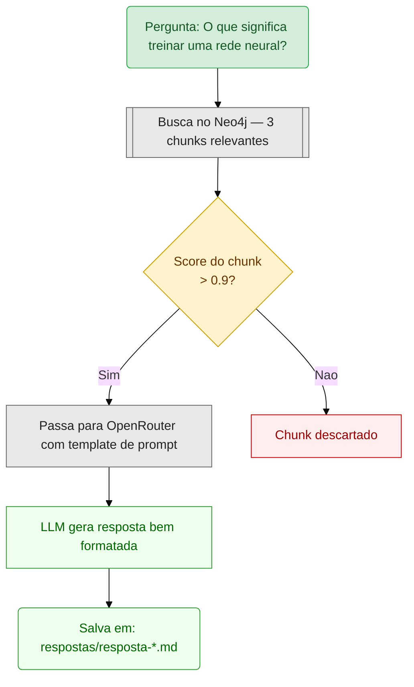
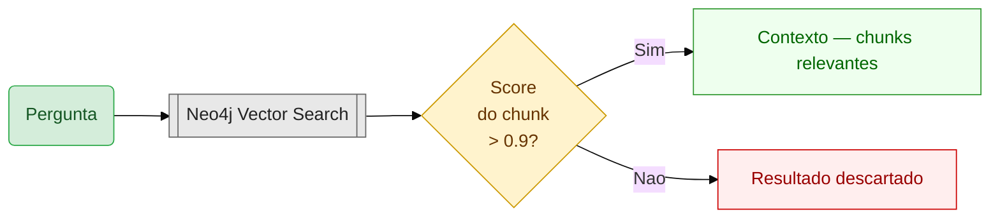
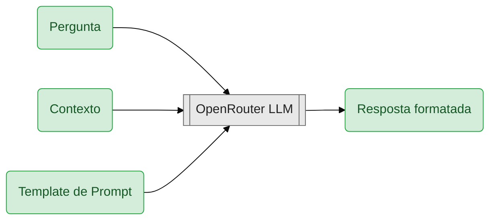
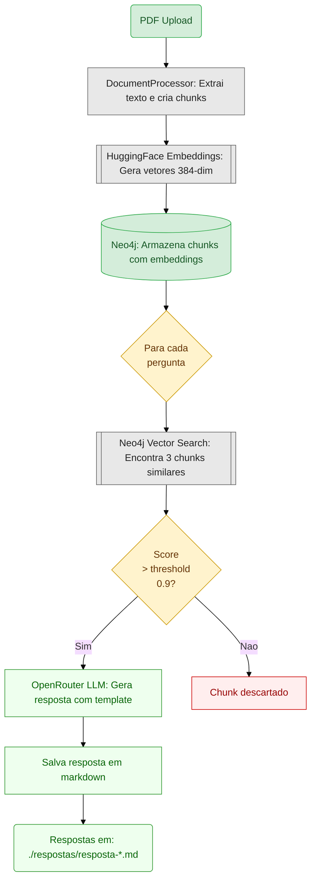

# Embeddings Neo4j - Sistema de Busca Semântica

## 📋 Descrição do Projeto

Projeto utilizado durante a Engenharia de Software em IA Aplicada - UNIPDS

Este projeto implementa um **sistema de busca semântica** usando embeddings de texto e Neo4j como banco de dados vetorial. O sistema carrega um PDF, gera representações vetoriais (embeddings) do seu conteúdo e permite realizar buscas por similaridade usando linguagem natural.

### O que o projeto faz:
1. **Carrega um PDF de documentação** do disco
2. **Divide o texto em chunks** (pedaços menores) para melhor processamento
3. **Gera embeddings** (representações vetoriais) de cada chunk usando modelos de IA
4. **Armazena no Neo4j** como um banco de dados vetorial
5. **Realiza buscas por similaridade** - encontra chunks similares a perguntas em linguagem natural

---

## 🛠️ Ferramentas e Tecnologias

### Core
- **Node.js** v22.13.1 - Runtime JavaScript
- **TypeScript** - Tipagem estática

### IA e Embeddings
- **@huggingface/transformers** - Geração de embeddings localmente (modelo: `all-MiniLM-L6-v2`)
- **LangChain** (@langchain/community, @langchain/core) - Framework para aplicações com IA
- **Neo4j Vector Store** - Integração LangChain com Neo4j

### Banco de Dados
- **Neo4j 5.14.0** - Banco de dados em grafo com suporte a busca vetorial (rodando via Docker)
- **neo4j-driver** - Driver Node.js para Neo4j

### Processamento de Documentos
- **pdf-parse** - Extração de texto de PDFs
- **LangChain Text Splitter** - Divisão inteligente de textos em chunks

### APIs e Generação de Respostas
- **OpenRouter** - Acesso a múltiplos modelos de LLM (ex: GPT-4, Claude, Mistral)
- **LangChain Prompts** - Framework para templates e composição de prompts
- **LangChain Runnables** - Pipelines compostos para encadear operações

---

## 🚀 Como Usar

### Pré-requisitos
- Node.js v22.13.1 ou superior
- Docker e Docker Compose instalados
- PDFs de documentação na pasta `base_documental/` (já incluídos no repositório)

### 0️⃣ Instalar dependências

```bash
npm install
```

### 1️⃣ Iniciar a Infraestrutura (Neo4j)

```bash
npm run infra:up
```

Isso vai:
- Iniciar um container Neo4j na porta **7699** (Bolt Protocol)
- Interface web disponível em: **http://localhost:7475**
- Credenciais padrão:
  - Usuário: `neo4j`
  - Senha: `password`

### 2️⃣ Configurar Variáveis de Ambiente

Crie um arquivo `.env` na raiz do projeto (já deve existir):

```env
# Neo4j Configuration
NEO4J_URI=bolt://localhost:7687
NEO4J_USER=neo4j
NEO4J_PASSWORD=password
NEO4J_VECTOR_THRESHOLD=0.9          # Score mínimo para considerar resultado relevante (0.0-1.0)

# Embedding Model
EMBEDDING_MODEL=Xenova/all-MiniLM-L6-v2

# OpenRouter Configuration (requerido para gerar respostas)
NLP_MODEL=openrouter/free            # Modelo a usar (free ou pago)
OPENROUTER_API_KEY=sk-or-v1-...     # Sua chave de API do OpenRouter
OPENROUTER_SITE_URL=http://localhost:3000
OPENROUTER_SITE_NAME=Neo4j Embeddings
```

**Variáveis Importantes:**
- `NEO4J_VECTOR_THRESHOLD`: Ajuste este valor para filtrar resultados
  - `0.5-0.7`: Resultados mais soltos (mais volume)
  - `0.8-0.9`: Resultados relevantes (recomendado)
  - `0.95+`: Resultados muito similares (filtro rigoroso)

### 3️⃣ Rodar a Aplicação

```bash
ntl
```

```
? Select a task: (Use arrow keys)
❯ start
  dev
  infra:up
  infra:down
```

| Script | O que faz |
|--------|-----------|
| `start` | Execução única — processa `base_documental/modulo01.pdf` e responde as perguntas |
| `start:ingresso` | Execução única — processa `base_documental/rag_ingresso_doc_chamados.pdf` com prompt de suporte ao Sistema de Ingresso IFSC |
| `dev` | Modo watch com recarregamento automático (RAG tensores) |
| `dev:ingresso` | Modo watch com recarregamento automático (RAG ingresso) |
| `infra:up` | Sobe o Neo4j via Docker |
| `infra:down` | Para o Neo4j e remove volumes |

### 4️⃣ Parar a Infraestrutura

```bash
npm run infra:down
```

---

## 📊 O que o `src/index.ts` faz

### Etapa 1: Carregamento e Processamento do PDF
- Carrega o arquivo de documentação configurado em `CONFIG.pdf.path`
- Divide o texto em chunks de **1000 caracteres** com **200 caracteres de sobreposição**
- Cria objetos de documento para processamento

### Etapa 2: Geração de Embeddings
- Inicializa o modelo `Xenova/all-MiniLM-L6-v2` (executado localmente via HuggingFace Transformers)
- Gera vetores de 384 dimensões para cada chunk
- Usa a configuração `fp32` para qualidade máxima

### Etapa 3: Armazenamento no Neo4j
- Limpa dados anteriores (remove nodes do tipo `Chunk`)
- Cria conexão com Neo4j usando o `Neo4jVectorStore`
- Salva cada documento com seu embedding no banco

### Etapa 4: Busca por Similaridade e Geração de Respostas
- **Busca Vetorial**: Encontra os 3 chunks mais relevantes no Neo4j
- **Filtro de Relevância**: Seleciona apenas resultados com score > 0.9 (threshold configurável)
- **Geração de Resposta com IA**:
  - Usa OpenRouter para acessar modelos de LLM
  - Aplica um **template de prompt** customizável com instruções específicas
  - Configura: role, task, tone, language, format, instructions
  - Passa o contexto relevante (chunks encontrados) para o LLM gerar uma resposta fundamentada
- **Persistência**: Salva cada resposta em um arquivo Markdown individual na pasta `respostas/`
- **Logs**: Exibe score do melhor resultado e informações de depuração

**Exemplo de Fluxo:**



---

## 🤖 Sistema de Resposta com IA (Classe AI)

### Como Funciona

A classe `AI` (`src/ai.ts`) implementa um pipeline em 2 etapas:

#### 1️⃣ Recuperação de Contexto (`retrieveVectorSearchResults`)



- Busca os `topK` (padrão: 3) documentos mais similares
- Retorna apenas resultados com alta relevância (> 0.9)
- Prepara o contexto juntando os chunks encontrados

#### 2️⃣ Geração de Resposta (`generateNLResponse`)


- Usa um **template de prompt dinâmico** (arquivo `prompts/template.txt`)
- Injeta variáveis:
  - `{role}` - Papel da IA (ex: "especialista em TensorFlow")
  - `{task}` - Tarefa a executar
  - `{tone}` - Tom da resposta (ex: "educativo e detalhado")
  - `{language}` - Idioma (ex: "português")
  - `{format}` - Formato desejado (ex: "markdown")
  - `{instructions}` - Lista de instruções específicas
  - `{question}` - Pergunta original
  - `{context}` - Chunks relevantes encontrados
- Envia para OpenRouter que processa com LLM configurado

### Configuração de Prompts

Os prompts são carregados de arquivos JSON e TXT:

**`prompts/answerPrompt.json`:**
```json
{
  "role": "especialista em machine learning e TensorFlow.js",
  "task": "Responder perguntas sobre tensores e redes neurais",
  "tone": "educativo, claro e detalhado",
  "language": "português",
  "format": "markdown com exemplos quando possível",
  "instructions": [
    "Use o contexto fornecido como base",
    "Se não souber, diga explicitamente",
    "Inclua exemplos práticos quando relevante"
  ]
}
```

**`prompts/template.txt`:**
```
You are a {role}.

Your task is: {task}
Tone: {tone}
Language: {language}
Format: {format}

Instructions:
{instructions}

Question: {question}

Context from documents:
{context}

Please answer the question based on the provided context.
```

---

## 📁 Estrutura de Arquivos

```
.
├── src/
│   ├── index.ts              # RAG tensores — ponto de entrada principal
│   ├── index.ingresso.ts     # RAG ingresso — ponto de entrada para suporte ao Sistema de Ingresso
│   ├── config.ts             # Configurações do RAG tensores
│   ├── config.ingresso.ts    # Configurações do RAG ingresso (nodeLabel, pdf, prompt separados)
│   ├── ai.ts                 # Classe AI com pipeline de IA (compartilhada pelos dois RAGs)
│   ├── documentProcessor.ts  # Carregamento e processamento de PDF
│   └── util.ts               # Funções auxiliares
├── prompts/
│   ├── answerPrompt.json           # Prompt do RAG tensores (role: TensorFlow/ML)
│   ├── template.txt                # Template do RAG tensores
│   ├── answerPrompt.ingresso.json  # Prompt do RAG ingresso (role: suporte ao Sistema de Ingresso)
│   └── template.ingresso.txt       # Template do RAG ingresso
├── base_documental/
│   ├── modulo01.pdf                # PDF base do RAG tensores
│   ├── tensores.pdf                # PDF alternativo de tensores
│   └── rag_ingresso_doc_chamados.pdf  # Base de chamados do Sistema de Ingresso IFSC
├── respostas/                # Respostas geradas (gerada automaticamente, não versionada)
│   └── resposta-*.md         # RAG tensores: só resposta
│   └── resposta-ingresso-*.md  # RAG ingresso: pergunta + resposta em markdown
├── neo4j/                    # Volumes do Docker Neo4j (gerados pelo docker-compose)
├── docker-compose.yml        # Configuração do Neo4j
├── package.json              # Dependências e scripts
├── .env                      # Variáveis de ambiente (não versionado)
└── .gitignore
```

---

## 🔍 Exemplo de Saída

```
🚀 Inicializando sistema de Embeddings com Neo4j...

✅ Adicionando documento 1/10
✅ Adicionando documento 2/10
...

🔍 ETAPA 2: Executando buscas por similaridade...

================================================================================
📌 PERGUNTA: O que são tensores?
================================================================================
[Resultado 1] - Similaridade: 0.92
[Resultado 2] - Similaridade: 0.87
[Resultado 3] - Similaridade: 0.81
```

---

## 🔗 Acessar Neo4j Browser

Enquanto a infra está rodando, acesse:
- **URL**: http://localhost:7475
- **Usuário**: neo4j
- **Senha**: password

Consulta útil para ver os dados:
```cypher
MATCH (n:Chunk) RETURN n LIMIT 10
```

---

## 🎯 Customização de Prompts

### Modificar o Comportamento da IA

1. **Edite `prompts/answerPrompt.json`:**
```json
{
  "role": "seu novo papel aqui",
  "task": "nova tarefa",
  "tone": "novo tom",
  "language": "novo idioma",
  "format": "novo formato",
  "instructions": ["instrução 1", "instrução 2"]
}
```

2. **Edite `prompts/template.txt`:**
- Customize o template do prompt
- Remova ou adicione variáveis conforme necessário
- Use `{variavel}` para placeholders

3. **Teste a nova configuração:**
```bash
npm start
```

As respostas geradas refletirão a nova configuração do prompt.

---

## 💡 Próximos Passos

1. **Customizar Prompts**: Experimente diferentes roles, tones e formats
2. **Ajustar Threshold**: Modifique `NEO4J_VECTOR_THRESHOLD` no `.env` para variar relevância
3. **Mudar PDF**: Use outro documento em `CONFIG.pdf.path`
4. **Adicionar Perguntas**: Expanda a lista em `index.ts`
5. **API REST**: Integre com Express/Fastify para interface web
6. **Modelos Diferentes**: Teste outros modelos via OpenRouter
7. **Feedback Loop**: Refine prompts baseado nos resultados

---

## 🔄 Fluxo Completo de Execução



## 📁 Onde Encontrar as Respostas

Após executar `npm start`, as respostas são salvas em:

```
./respostas/resposta-O que significa treinar uma rede neural?-1711270800000.md
```

**Para visualizar:**
```bash
cat ./respostas/resposta-*.md
```

---

## 📝 Notas Importantes

- ✅ **Embeddings Locais**: Gerados com HuggingFace (sem APIs externas necessárias)
- ✅ **Neo4j Vetorial**: Armazena e busca por similaridade muito rápido
- ✅ **LLM via OpenRouter**: Acesso a múltiplos modelos com uma API unificada
- ✅ **Prompts Customizáveis**: Totalmente controlável via JSON e template
- ⏱️ **Tempo de Execução**:
  - Primeira vez: Longo (carregamento de modelos)
  - Próximas: Mais rápido (modelos em cache)
- 🔄 **Cada execução limpa e recarrega** do PDF (para manter dados consistentes)
- 💾 **Respostas persistem** em arquivos markdown

---

## 🏫 RAG do Sistema de Ingresso IFSC (`start:ingresso`)

Este projeto inclui um segundo RAG configurado para um cenário real: **apoio inicial a chamados do Sistema de Ingresso do IFSC** (sistemadeingresso.ifsc.edu.br).

### O que é diferente em relação ao `start`

| Aspecto | `start` (tensores) | `start:ingresso` |
|---|---|---|
| Documento base | `base_documental/modulo01.pdf` | `base_documental/rag_ingresso_doc_chamados.pdf` |
| Role do assistente | Especialista em TensorFlow/ML | Suporte ao Sistema de Ingresso IFSC |
| Prompt | `answerPrompt.json` + `template.txt` | `answerPrompt.ingresso.json` + `template.ingresso.txt` |
| Node label Neo4j | `Chunk` | `ChunkIngresso` |
| Index Neo4j | `tensors_index` | `ingresso_index` |
| Arquivo de saída | `resposta-*.md` (só resposta) | `resposta-ingresso-*.md` (pergunta + resposta) |
| topK | 3 | 4 |
| Temperature | 0.3 | 0.2 (mais determinístico) |

### Por que labels separados no Neo4j?

Os dois RAGs usam a **mesma instância Neo4j**, mas com `nodeLabel` diferentes (`Chunk` e `ChunkIngresso`). Isso garante que os embeddings dos dois documentos ficam isolados — a busca vetorial de um não "contamina" os resultados do outro.

Para visualizar cada base separadamente no Neo4j Browser:
```cypher
-- Chunks do RAG tensores
MATCH (n:Chunk) RETURN n LIMIT 25

-- Chunks do RAG ingresso
MATCH (n:ChunkIngresso) RETURN n LIMIT 25
```

Para limpar e reprocessar somente o ingresso:
```cypher
MATCH (n:ChunkIngresso) DETACH DELETE n
```

### Como rodar

```bash
npm run start:ingresso
# ou com watch:
npm run dev:ingresso
```

### O que o prompt de ingresso faz diferente

O `answerPrompt.ingresso.json` instrui o modelo a:
- Priorizar soluções que o DEING pode executar **pela interface do sistema**, sem precisar abrir chamado
- Descrever o **caminho de menu** quando existir (ex: `Sistema de Ingresso (admin) > Cadastro > Verificar Candidato v2`)
- Citar o **número do chamado de referência** da base de conhecimento
- Indicar explicitamente quando o problema **exige intervenção do DSI** (script SQL / banco de dados)

### Formato das respostas

Diferente do RAG de tensores, os arquivos gerados pelo `start:ingresso` incluem sempre a pergunta no cabeçalho:

```markdown
## Pergunta

Candidatos aprovados não aparecem para importação no SIGAA após a geração da chamada...

## Resposta

Com base na documentação de chamados resolvidos...
```

---

## 🐛 Troubleshooting

| Problema | Solução |
|----------|---------|
| `NEO4J_URI not found` | Certifique-se que `.env` existe com `NEO4J_URI=bolt://...` |
| `OpenRouter API error` | Verifique sua chave `OPENROUTER_API_KEY` está correta |
| `Nenhum resultado encontrado` | Aumente `NEO4J_VECTOR_THRESHOLD` ou verifique o PDF |
| `Modelo não encontrado` | Verifique o modelo em `EMBEDDING_MODEL` ou `NLP_MODEL` |
| Permissão de escrita | Crie a pasta `respostas/` manualmente ou execute com `mkdir -p respostas/` |

