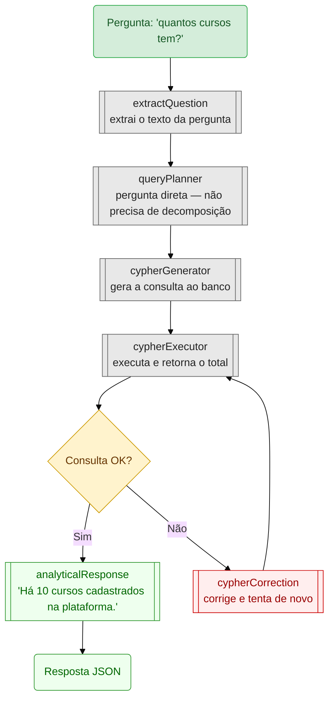
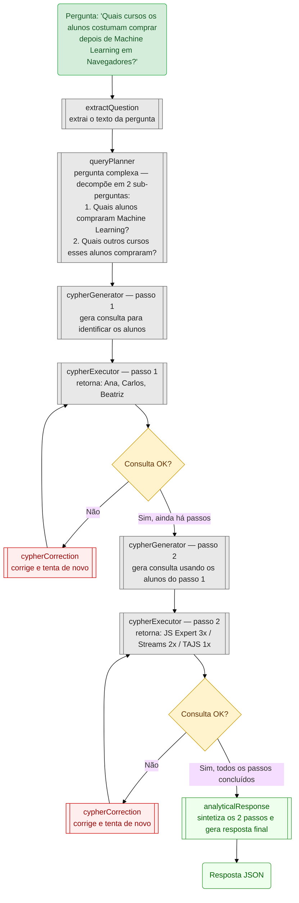
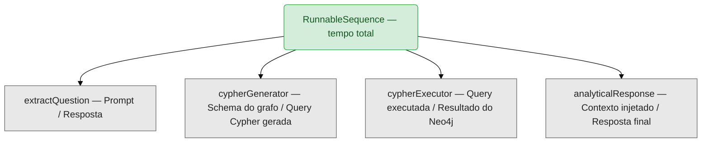

# Graph RAG com LangGraph — Sales Analytics

Sistema de perguntas e respostas sobre dados de vendas de cursos usando **Graph RAG**:
o LLM gera Cypher dinamicamente para consultar um grafo Neo4j e responde em linguagem natural.

**Projeto utilizado no Lab 04 — Workshop IA para Devs (IFSC/DSI)**

---

## O que o projeto faz

1. Recebe uma pergunta em linguagem natural via API REST
2. Analisa a complexidade da pergunta (simples ou multi-etapa)
3. Gera uma query Cypher usando o schema do grafo Neo4j
4. Executa a query no Neo4j — se falhar, tenta corrigir automaticamente
5. Formata a resposta em linguagem natural com o LLM
6. Retorna a resposta via JSON e registra o trace no LangSmith

---

## Pré-requisitos

- Node.js >= 24.10.0
- Docker e Docker Compose instalados
- Conta e API key no [OpenRouter](https://openrouter.ai/) (modelos gratuitos disponíveis)
- Conta e API key no [LangSmith](https://smith.langchain.com/) (tracing opcional, mas recomendado)

---

## Como rodar

### 1. Instalar dependências

```bash
npm install
```

### 2. Configurar variáveis de ambiente

Copie o `.env.example` e preencha suas chaves:

```bash
cp .env.example .env
```

```env
OPENROUTER_API_KEY=sk-or-v1-...

LANGSMITH_API_KEY=lsv2_pt_...
LANGCHAIN_TRACING_V2=true
LANGCHAIN_PROJECT=graph-rag-langgraph
```

> As credenciais do Neo4j estão hardcoded em `src/config.ts` (`neo4j/password`) — combinam com o docker-compose padrão.

### 3. Subir a infraestrutura (Neo4j)

```bash
npm run docker:infra:up
```

Neo4j sobe em:
- **Bolt (queries):** `localhost:7687`
- **Browser (interface web):** `http://localhost:7474` — usuário `neo4j`, senha `password`

### 4. Popular o banco com dados de exemplo

```bash
npm run seed
```

Cria nós de alunos, cursos, compras e progresso no grafo a partir dos arquivos em `data/`:

| Arquivo | Conteúdo |
|---------|----------|
| `data/courses.json` | 10 cursos fixos (ErickWendel Academy) |
| `data/seedHelpers.ts` | Gera 20 alunos, vendas e progresso com `@faker-js/faker` |
| `data/seed.ts` | Entrypoint que chama `seedDatabase()` |

### 4.1. Visualizar os dados no Neo4j Browser

Após rodar o seed, abra o Neo4j Browser:

1. Acesse **http://localhost:7474** no navegador
2. Faça login com usuário `neo4j` e senha `password`
3. No campo de query (topo da tela), execute as queries abaixo:

**Ver todos os nós e relacionamentos (visão geral do grafo):**
```cypher
MATCH (n) RETURN n LIMIT 50
```

**Ver alunos e seus cursos comprados:**
```cypher
MATCH (s:Student)-[p:PURCHASED]->(c:Course)
RETURN s.name AS aluno, c.name AS curso, p.status AS status, p.amount AS valor
ORDER BY s.name
LIMIT 50
```

**Ver apenas compras pagas com progresso:**
```cypher
MATCH (s:Student)-[:PURCHASED {status: "paid"}]->(c:Course)<-[pr:PROGRESS]-(s)
RETURN s.name AS aluno, c.name AS curso, pr.progress AS progresso
ORDER BY pr.progress DESC
LIMIT 50
```

**Resumo por curso (receita e total de alunos):**
```cypher
MATCH (s:Student)-[p:PURCHASED]->(c:Course)
WHERE p.status = "paid"
RETURN c.name AS curso, COUNT(s) AS alunos, SUM(p.amount) AS receita
ORDER BY receita DESC
```

> **Dica:** clique em qualquer nó do grafo visual para ver suas propriedades no painel lateral.

### 5. Rodar via menu interativo

```bash
ntl
```

```
? Select a task: (Use arrow keys)
❯ start
  dev
  seed
  test:e2e
  docker:infra:up
  docker:infra:down
  docker:infra:cleanup
```

| Script | O que faz |
|--------|-----------|
| `start` | Sobe o servidor na porta 4000 e faz uma query de teste |
| `dev` | Modo watch com inspector habilitado |
| `seed` | Popula o Neo4j com dados de cursos, alunos e compras |
| `langgraph:serve` | Abre o LangGraph Studio no navegador (interface visual do grafo) |
| `test:e2e` | Roda os testes de integração reais |
| `docker:infra:up` | Sobe o Neo4j |
| `docker:infra:down` | Para o Neo4j |
| `docker:infra:cleanup` | Remove containers, volumes e pasta storage |

### 6. Testar a API

Com o servidor rodando (`npm start` ou `ntl → start`):

```bash
curl -X POST http://localhost:4000/sales \
  -H "Content-Type: application/json" \
  -d '{"question": "Quais cursos são comprados juntos com mais frequência?"}'
```

---

## Arquitetura — Pipeline LangGraph

### Cenário simples: "quantos cursos tem?"



### Cenário complexo: "Quais cursos os alunos costumam comprar depois de 'Machine Learning em Navegadores'?"

O resultado do passo 1 alimenta o passo 2: primeiro descobre quem comprou o curso, depois usa esses alunos para encontrar o que mais compraram.



No cenário simples o `queryPlanner` passa direto para um único ciclo de geração e execução. No complexo ele decompõe a pergunta e o par `cypherGenerator` + `cypherExecutor` roda em loop até esgotar todos os passos antes de chegar no `analyticalResponse`.

---

## Visualizar traces no LangSmith

Com `LANGCHAIN_TRACING_V2=true`, cada execução gera um trace no LangSmith mostrando:
- Tempo de cada nó
- Prompt enviado e resposta recebida
- Query Cypher gerada
- Resultado do banco

**Abrir o LangGraph Studio (interface visual local):**

```bash
ntl
# selecione: langgraph:serve
```

Isso roda `npx @langchain/langgraph-cli dev` e abre o **LangGraph Studio** no navegador — uma interface visual que mostra o grafo de nós em tempo real, permite inspecionar o estado a cada passo e re-executar nós individualmente.

**Como navegar no LangSmith (traces remotos):**

1. Acesse [https://smith.langchain.com/](https://smith.langchain.com/) e faça login
2. No menu lateral, clique em **Projects**
3. Abra o projeto `graph-rag-langgraph` (nome definido em `LANGCHAIN_PROJECT` no `.env`)
4. Cada linha da lista é uma execução — clique em qualquer uma para abrir o trace
5. Dentro do trace você vê a árvore de nós do pipeline:



6. Clique em cada nó para ver o prompt exato que foi enviado ao LLM e a resposta recebida
7. Use a aba **Feedback** para comparar execuções diferentes

> **Dica para o lab:** rode a mesma pergunta duas vezes e compare os traces lado a lado — útil para ver como o Cypher gerado varia entre execuções.

---

## Parar a infraestrutura

```bash
npm run docker:infra:down

# Para remover volumes e recomeçar do zero:
npm run docker:infra:cleanup
```
