# Capacitação DSI — Aprimoramento em Desenvolvimento Auxiliado por LLM

> Material complementar do curso ministrado pelo instrutor Daniel Severo Estrázulas, DSI - Departamento de Sistemas de Informação do Instituto Federal de Santa Catarina (daniel.estrazulas@ifsc.edu.br). Carga horária de 16 horas, sendo 8 horas nesta parte — Módulos 1 e 2 em 13/08/2026; Módulos 3 e 4 em 21/08/2026.

---

## Introdução

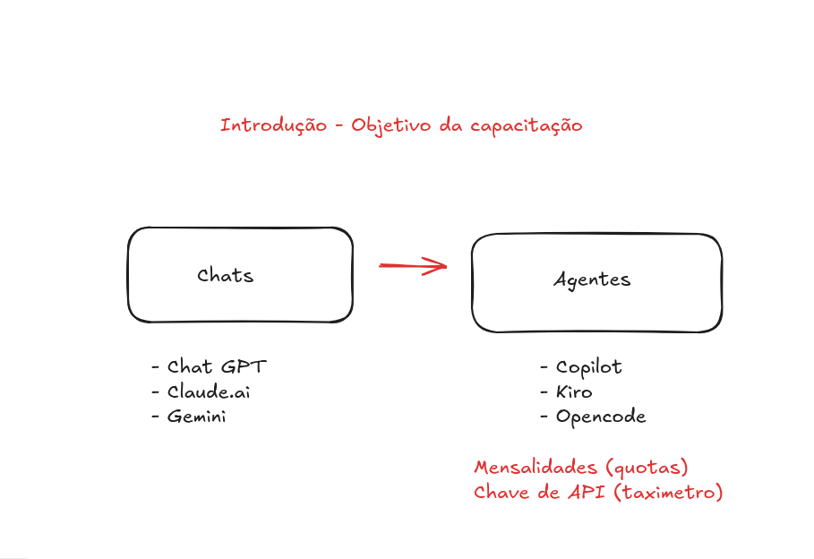
> Slide: Introdução — Objetivo da capacitação (Chats → Agentes)

Esta capacitação é um nivelamento para as equipes dos departamentos de sistemas dos institutos federais. O ponto de partida é um cenário comum: a maioria dos devs usa IA no modo iniciante. Abre o chat no navegador — ChatGPT, Claude.ai, Gemini — copia um trecho de código, cola na conversa, recebe a resposta e cola de volta no projeto. A IA não vê o resto do sistema, não conhece as convenções do time e não toca em nenhum arquivo — toda a integração depende de você carregando contexto manualmente, mensagem após mensagem. Cada nova conversa começa do zero, e os tokens gastos repetindo contexto somem sem deixar rastro.

O objetivo aqui é migrar desse modo para o uso de agentes integrados — Copilot, Kiro, Opencode. A diferença vai além da conveniência: chats isolados funcionam com mensalidades fixas (quotas), enquanto agentes integrados consomem chave de API como taxímetro. Cada token é cobrado. Contexto mal montado vira dinheiro queimado em tempo real. Nesse modelo, a IA roda dentro do seu ambiente de desenvolvimento, com acesso aos arquivos do projeto, às ferramentas certas e ao contexto que precisa para responder com precisão. O ganho é duplo: você gasta menos token repetindo informação e recebe respostas mais acertivas, porque o modelo trabalha com o contexto real do software que está sendo desenvolvido.

Para chegar lá, o caminho passa por entender como a ferramenta funciona por dentro. É isso que você vai ver em cada módulo:

- **Módulo 1 — Como LLMs Funcionam de Verdade**: o modelo mental correto sobre LLMs (um autocomplete estatístico, não um oráculo), tokens, janela de contexto, as 4 limitações e quando não usar IA.
- **Módulo 2 — Ecossistema Open-Source**: modelos abertos e proprietários, Ollama, Hugging Face, parâmetros de geração e como decidir entre execução local e nuvem.
- **Módulo 3 — Prompt Engineering**: os 5 elementos de um prompt eficiente, os frameworks RTF, CARE e RISE, e as técnicas zero-shot, few-shot e chain of thought.
- **Módulo 4 — RAG, Embeddings e Engenharia de Contexto**: como dar conhecimento específico à IA sem retreinar nada, o pipeline RAG em 5 etapas, embeddings e variações como Graph RAG e RAG multimodal.
- **Módulo 5 — MCP e Agentes de IA**: o protocolo que conecta a IA a ferramentas externas, a anatomia de um agente e o loop de execução que separa um chat de um sistema que age.
- **Módulo 6 — Arquitetura de Contexto**: os 4 pilares do contexto de um projeto — rules/Agents.md, skills, MCPs e sub-agents — e como organizar cada um.
- **Módulo 7 — SDD e Ferramentas na Prática**: Spec-Driven Development, STATE.md, os frameworks OpenSpec, TLC e Kiro, e como validar o código que a IA gera.

Ao final, o esperado é que você tenha saído do "conversar com um chatbot" para o "trabalhar com um agente integrado": contexto bem montado, tokens gastos com critério e resultados mais confiáveis no software desenvolvido com IA.

---

## Módulo 1 — Como LLMs Funcionam de Verdade

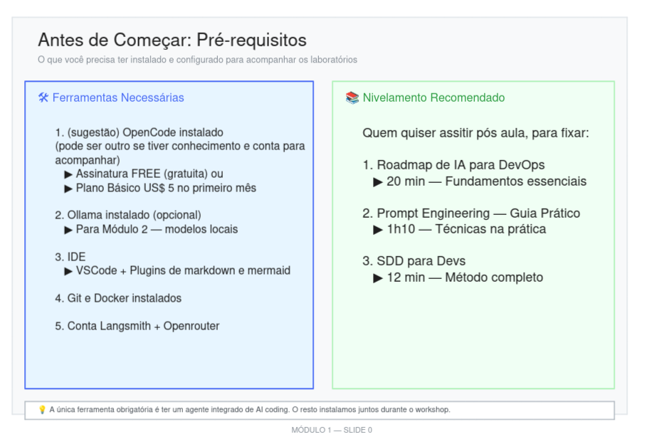
> Slide 0 — Antes de Começar: Pré-requisitos (Ferramentas e Nivelamento)

A única ferramenta obrigatória é ter um agente integrado de codificação com IA instalado, o resto a gente configura junto durante o workshop. Ollama fica como opcional (vai ser útil no Módulo 2, quando rodarmos modelos locais). IDE com plugins de markdown e mermaid ajuda a visualizar os diagramas que vão aparecer. Git e Docker já são parte do dia a dia de qualquer dev. Conta no Langsmith e Openrouter servem para acompanhar o consumo de tokens e comparar custos entre modelos, vamos usar isso na prática.

**Vídeos de nivelamento recomendados:**

- [Roadmap de IA para DevOps](https://youtu.be/03-nB_KMm44) — Fabrício Veronez (20 min)
- [Prompt Engineering — Guia Prático](https://youtu.be/Qf_QHxuc8J8) — Fabrício Veronez (2h)
- [SDD: Habilidade #1 para Devs](https://youtu.be/YFDp-smGYqQ) — Waldemar Neto (12 min)

### O grande autocomplete

Uma IA é um sistema que aprende com dados para executar uma tarefa. Não é sobre replicar comportamento humano: por trás de tudo existem matemática e estatística. São algoritmos que aprendem padrões a partir dos dados.

Os modelos por trás do ChatGPT, do Gemini e do Claude foram treinados lendo bilhões de textos que já existiam na internet. Nesse processo, eles aprenderam quais palavras costumam aparecer juntas por pura repetição estatística. Quando o modelo lê "O céu é...", ele calcula probabilidades e escolhe "azul".

Não é decoreba. O modelo avalia o contexto ao redor com análises matemáticas de proximidade, peso e relevância entre as palavras. Se a frase for "Ontem à noite olhei para cima e o céu estava...", o mecanismo de atenção foca nas palavras que mudam o jogo: "noite" e "olhei para cima". A estatística é recalculada na hora e a resposta vira "escuro" ou "estrelado".

O modelo mental correto é o autocompletar do celular. Quando você digita "Vamos fazer um...", o celular sugere café, bolo, passeio. Se a conversa for sobre código há 20 minutos, a LLM sugere deploy, teste, script. É exatamente o mesmo mecanismo, só que com muito mais contexto.

Isso muda como você escreve prompts e interpreta respostas. Tratar a IA como oráculo que sabe tudo é o caminho mais rápido para respostas ruins. Enxergar a IA como completador de padrões que precisa de contexto de qualidade muda o jogo. Quando você para de culpar a IA e começa a melhorar o contexto, os resultados melhoram.

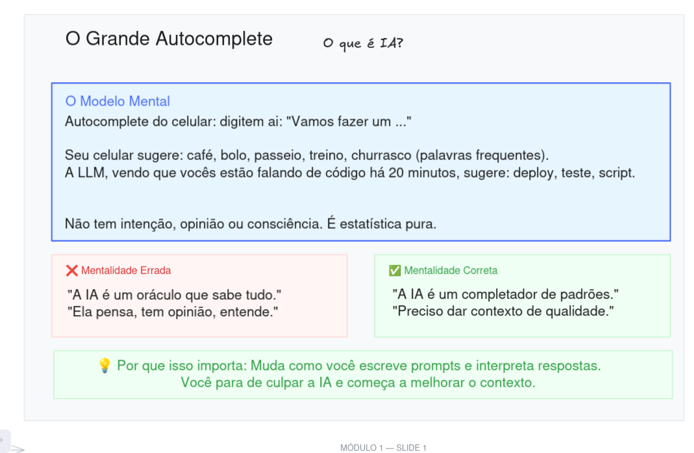
> Slide 1 — O Grande Autocomplete / O que é IA?

### Tokens: a moeda da IA

Token é a unidade básica de processamento do modelo. Pense nele como um pedaço de palavra: a expressão "Bom dia", por exemplo, custa 2 tokens. Toda API de IA cobra por token, tanto pelo que você envia (entrada) quanto pelo que ela responde (saída). A saída costuma ser mais cara.

Duas analogias para fixar: token é o kilowatt da IA (você paga pelo consumo, como na conta de luz) ou a ficha do fliperama (sem ficha, a máquina não joga).

Para experimentar: o [Token Visualizer](https://onedev.tools/ai/token-visualizer) mostra em tempo real como um texto é fatiado em tokens. O [OpenRouter](https://openrouter.ai) permite comparar o custo da mesma pergunta entre modelos diferentes (por exemplo, Claude Opus vs DeepSeek), e a [tabela do OpenCode](https://opencode.ai/docs/go/) mostra preços por modelo.

O risco de alucinar cresce com o contexto. Num fluxo simples: prompt "Qual ferramenta uso para testes unitários em Java?" → LLM responde "JUnit" → prompt "Como instala?" → LLM responde "Via Maven ou Gradle", cada troca acumula tokens. Se o contexto enche, o modelo perde o fio da meada e começa a inventar. Quanto mais contexto você joga de uma vez, mais a IA se perde e dá mais peso às primeiras informações, esquecendo o que veio depois.

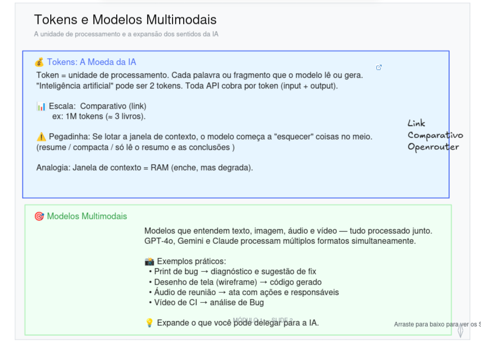
> Slide 2 — Tokens e Modelos Multimodais

### Modelos multimodais

O salto recente são os modelos multimodais, como GPT, Gemini e Claude. Eles não leem só texto: processam texto, imagem, áudio e vídeo ao mesmo tempo, na mesma rede neural. Na prática, isso muda o fluxo de trabalho:

- Você manda o print de um bug e a IA diagnostica e sugere a correção.
- Você desenha uma tela num papel de pão e ela gera o código HTML pronto.
- Você envia o áudio de uma reunião inteira e recebe a ata com os responsáveis pelas tarefas.
- Você sobe o vídeo de um erro no sistema e ela analisa onde a lógica falhou.

Resumindo: a multimodalidade expande muito o que dá para delegar para a IA hoje.

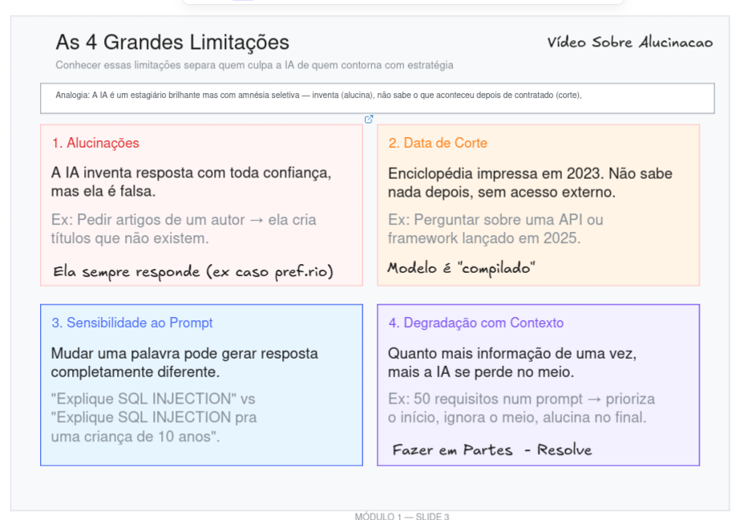
> Slide 3 — As 4 Grandes Limitações

### As 4 grandes limitações

Pense na IA como um estagiário brilhante, mas com amnésia seletiva. Ela tem quatro limitações que você precisa conhecer para diagnosticar problemas e contorná-las.

**1. Alucinação.** A IA inventa respostas com total confiança. Sendo justo, a gente também faz isso às vezes, e ninguém escreve "não sei" na internet, então a IA aprendeu o nosso padrão de sempre responder. O problema é que ela não sabe que não sabe: se você pedir uma integração entre Spring Boot 6 e uma biblioteca que não é compatível (ou nem existe), ela vai gerar o código sorrindo. Existem três tipos de alucinação:

- **Factual**: inventa dados. Você pergunta quem ganhou o campeonato de 2024 e ela chuta um time que nem jogou a final.
- **Raciocínio**: erra a lógica pura. "Se 1 camisa leva 1 hora para secar no sol, quanto tempo levam 5 camisas juntas?" Resposta alucinada: "5 horas."
- **Fidelidade**: contradiz o documento que você enviou. Você anexa um relatório que diz que a empresa teve lucro, e ela resume dizendo que a empresa faliu.

**2. Data de corte (knowledge cutoff).** O modelo é como uma enciclopédia impressa: não sabe nada do que aconteceu depois do treinamento, a menos que você dê acesso externo. Perguntou sobre uma API ou framework lançado depois do corte? Ele vai falhar ou inventar.

**3. Sensibilidade ao prompt.** Mudar uma única palavra muda o cálculo matemático inteiro. "Explique SQL injection" e "Explique SQL injection para uma criança de 10 anos" geram respostas de universos completamente diferentes. Isso é o poder e o perigo da ferramenta ao mesmo tempo.

**4. Degradação com o contexto.** Se você colocar 50 requisitos num único prompt, a IA prioriza o início, ignora o meio e alucina no final. Não é burrice: é o mecanismo de atenção se diluindo. Quanto mais tokens competindo por atenção, menos foco em cada um.

### Janela de contexto: o envio acumulativo

A janela de contexto é a quantidade máxima de tokens que o modelo consegue considerar de uma vez. Para ter noção de escala: o Gemini aguenta até 1 milhão de tokens, o equivalente a uns 3 livros inteiros na memória de uma só vez.

Mas existe uma pegadinha: se você lotar a janela, o modelo começa a esquecer coisas. A analogia é a memória RAM do computador: quando enche, o desempenho degrada. Para não travar, o modelo compacta as informações e passa a focar só no resumo e nas conclusões, ignorando detalhes do meio da conversa.

Um mito comum: "a IA lembra do que você falou". A realidade é que ela não lembra de nada: a cada mensagem, você envia de novo o prompt do sistema, todas as ferramentas disponíveis, todo o histórico da conversa e a mensagem nova.

Veja o que acontece numa tarefa simples de um agente corrigindo um bug num arquivo `hw.java`:

1. Você manda o prompt: "o arquivo hw.java está com problema". A LLM não tem a resposta ainda e pede uma tool call: `read_dir`.
2. O agente executa e devolve a listagem do diretório. A LLM responde: "preciso ler o hw.java" e faz outra tool call de leitura.
3. O conteúdo do arquivo chega como input. A LLM identifica o bug e chama `edit_file` para corrigir.

Três requests para uma tarefa simples. Em cada uma, o histórico inteiro é reenviado. É por isso que a conversa fica mais cara e mais lenta com o tempo, e é por isso que a IA parece "ficar mais burra" no final de conversas longas: o contexto encheu.

O contexto acumula de três formas: **entrada** (arquivos lidos, como o `hw.java`), **ferramentas** (as ferramentas disponíveis: `read_dir`, `write_file`, `edit_file`) e **outros** (instruções, MCPs, skills). Quanto mais ambíguo o prompt, mais o agente precisa descobrir, e cada descoberta enche a janela. Um prompt vago como "resolve o bug" força o agente a ler diretórios, testar hipóteses, carregar ferramentas extras. Um prompt preciso como "o método `main()` do `hw.java` tem erro de sintaxe na linha 3" já entrega o que o modelo precisa. Isso é engenharia de contexto: dar à LLM a informação certa para evitar que ela gaste tokens descobrindo o que você já sabia.

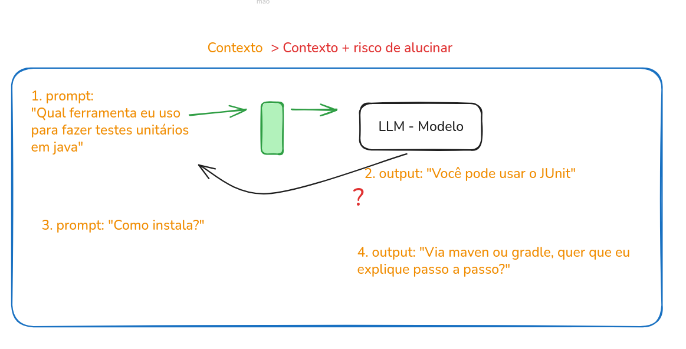
> Complementar: Contexto > Contexto + risco de alucinar (fluxo prompt → LLM → output com exemplo JUnit)

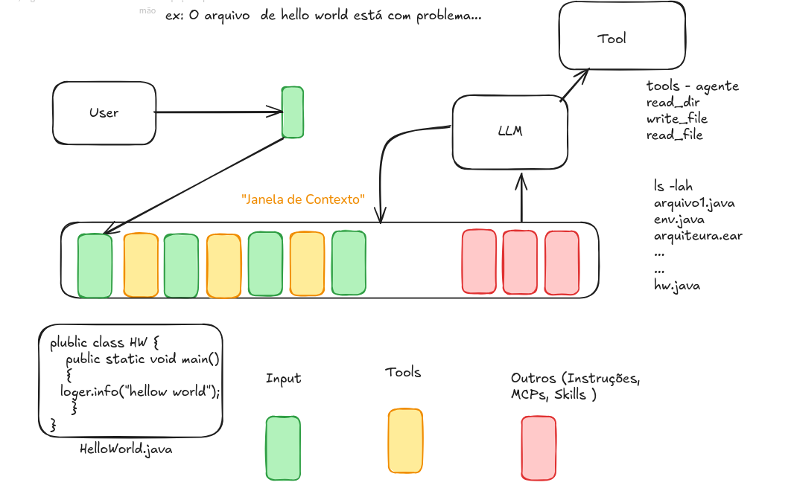
> Complementar: Janela de Contexto com Hello World (Input, Tools, Outros)

### Pré-treinamento, fine-tuning e RAG

Existem três formas de especializar o conhecimento de um modelo:

- **Pré-treinamento**: o modelo é treinado do zero com milhões de dados de toda a internet. O resultado é como um profissional com graduação em tudo, sabe um pouco de cada área, mas nada específico da sua empresa. GPT, Claude e Gemini são assim: sabem fazer de tudo de forma genérica, mas não sabem como o seu sistema funciona.
- **Fine-tuning**: você pega o modelo base e especializa para uma tarefa específica, como codificação. É como mandar esse formado fazer uma especialização em Java. Funciona, mas exige GPU, dados rotulados de qualidade e retreino sempre que o padrão muda.
- **RAG (Retrieval-Augmented Generation, ou Geração Aumentada por Recuperação)**: em vez de retreinar, você conecta o modelo a uma base de conhecimento vetorizada e entrega os documentos certos na hora da pergunta. É provavelmente a forma de especialização em que o dev consegue atuar sem grandes custos, e o assunto do Módulo 4.

As analogias ajudam: pré-treinamento é o chef formado (sabe de tudo, mas não conhece seu restaurante), fine-tuning é a especialização cara em sushi (funciona, mas é caro e difícil de atualizar), RAG é a receita na mão do chef (entrega o documento certo na hora certa). O RAG sai mais barato, mais rápido de implementar, mais fácil de atualizar, sem retreino e simples de depurar.

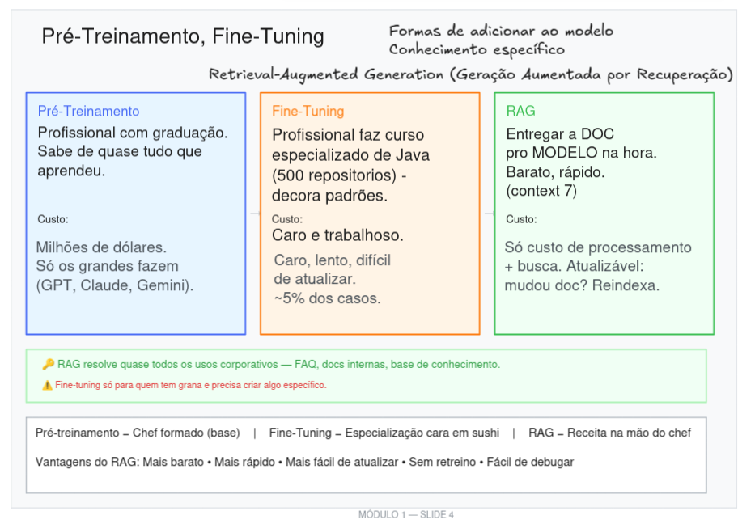
> Slide 4 — Pré-Treinamento, Fine-Tuning e RAG

### Quando NÃO usar IA

Você não chama um arquiteto para pendurar um quadro. Regex, parser, função matemática, SQL: algoritmos determinísticos resolvem essas tarefas melhor, mais barato e de forma previsível. A IA é não-determinística porque escolhe tokens por probabilidade, não por regras fixas: a mesma pergunta pode gerar respostas diferentes. Para validar um CPF, você quer a mesma resposta sempre. Regex te dá isso. IA, não.

Trate a IA como ferramenta estatística que depende de bom contexto, não como oráculo infalível.

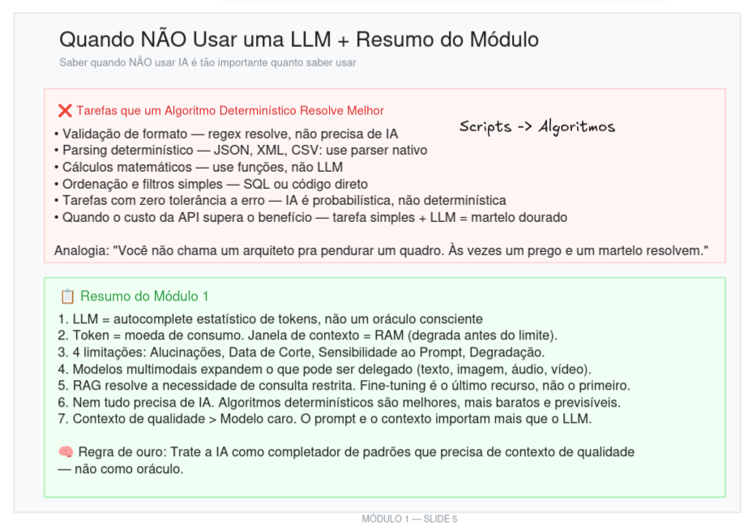
> Slide 5 — Quando NÃO Usar uma LLM + Resumo do Módulo

### Resumo do módulo

1. LLM é um autocomplete estatístico de tokens, não um oráculo consciente.
2. Token é a moeda de consumo. Janela de contexto é RAM: degrada antes do limite.
3. Quatro limitações: alucinação, data de corte, sensibilidade ao prompt e degradação com contexto.
4. Modelos multimodais expandem o que pode ser delegado: texto, imagem, áudio e vídeo.
5. RAG resolve a necessidade de consulta restrita. Fine-tuning é o último recurso, não o primeiro.
6. Nem tudo precisa de IA. Algoritmos determinísticos são melhores, mais baratos e previsíveis.
7. Contexto de qualidade vale mais que modelo caro. O prompt e o contexto importam mais que o LLM.

### Material complementar — Laboratório 1

O laboratório deste módulo é um exercício de diagnóstico. Você recebe 3 prompts com problemas reais (alucinação técnica, data de corte e alucinação científica), identifica qual limitação está em jogo em cada caso e reescreve o prompt para mitigar o problema. Todos os arquivos estão na pasta `labs/lab-01-fundamentos/`:

- `README.md` — instruções completas do laboratório, incluindo a seção Bônus (comparar tokens e custo do Caso 3 entre Claude Opus e DeepSeek no OpenRouter).
- `prompts/` — os 3 casos para diagnosticar.
- `ficha-diagnostico.md` — a ficha que você preenche com o diagnóstico e a reescrita.
- `session_view/` — o Session Viewer, um script que mostra o consumo crescente de tokens a cada request (`./session-viewer.sh`). Vale rodar para ver na prática o envio acumulativo do histórico. Exemplo de execução em `session_view/session-view.md`.
- `instalacao-dependencias.pdf` — guia de instalação das dependências necessárias para o laboratório.

---

## Módulo 2 — Ecossistema Open-Source e Execução Local

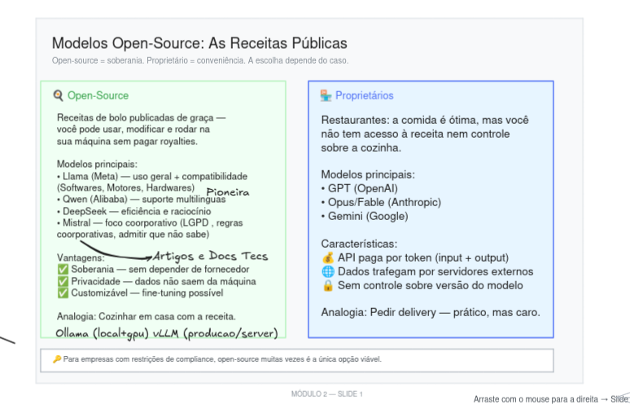
> Slide 1 — Modelos Open-Source vs Proprietários

### Modelos abertos e proprietários: receitas de bolo

Modelos open-source como Llama (Meta), Qwen (Alibaba), DeepSeek e Mistral são receitas de bolo publicadas de graça. Os "pesos" (os bilhões de números gerados durante o treinamento) ficam disponíveis na internet. Você baixa, roda na sua máquina, modifica se quiser. Seus dados não saem da sua rede, você não depende de fornecedor e a comunidade pode apontar melhorias e corrigir erros.

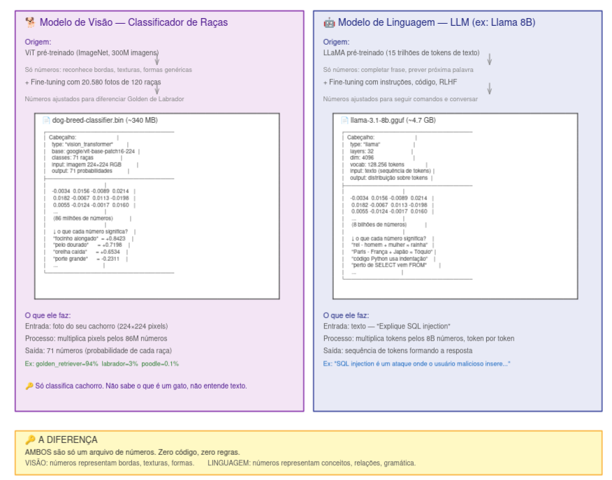
> Slide complementar — Modelo de Visão (classificador de raças) vs Modelo de Linguagem (LLM)

A Meta assumiu os custos do treinamento do Llama e liberou o resultado. Parece generosidade, mas tem estratégia por trás: ao oferecer modelos de qualidade de graça, reduz o poder de cobrança dos concorrentes e inicia uma guerra de preços. O Google respondeu lançando modelos abertos também, na disputa pelo coração dos devs. E tem o bônus de aquisição de talentos: cientistas preferem trabalhar em empresas onde podem publicar pesquisas.

Os proprietários (GPT-4o, Claude Opus/Sonnet, Gemini) são excelentes. Mas você não controla versão, não tem acesso à receita e seus dados trafegam por servidores de terceiros. Pra empresa com compliance rigoroso, open-source não é luxo, é requisito.

A pergunta certa não é "qual é melhor?". É "quando usar cada um?".

Os proprietários funcionam como restaurantes: a comida é ótima, mas você não tem acesso à receita nem controle sobre a cozinha. Pede delivery, prático, mas caro. Open-source é cozinhar em casa com a receita: você controla os ingredientes, ajusta o tempero, não paga royalty. Para empresas com restrições de compliance, open-source muitas vezes é a única opção viável.

### Ollama: o Docker dos modelos

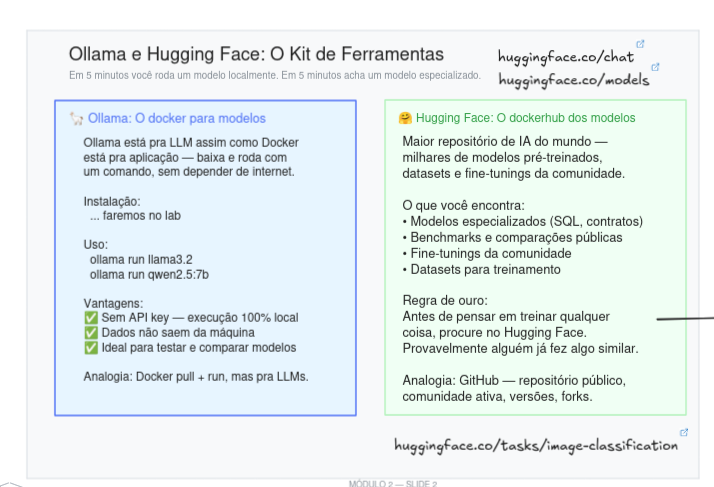
> Slide 2 — Ollama e Hugging Face

Ollama torna a execução local de LLMs trivial. A analogia é direta: Ollama está pra LLM assim como Docker está pra aplicação. Você instala, escolhe o modelo com `ollama run llama3.2` e em segundos tem um modelo rodando na sua máquina. Sem API key, sem internet, sem enviar dado pra lugar nenhum.

O funcionamento é parecido com o Docker: você faz o pull do modelo (baixa os pesos) e dá um run. A diferença é que em vez de container com aplicação, você tem um modelo de IA pronto pra receber prompts.

Você pode experimentar no laboratório: instalar o Ollama, rodar um modelo e fazer um prompt simples. Em 5 minutos está tudo funcionando, inclusive offline.

### Hugging Face: o GitHub dos modelos

Hugging Face é o maior repositório de modelos de IA do mundo. A comparação é natural: Hugging Face está pra modelo de IA assim como GitHub está pra código. Tem busca, estrelas, README, código de uso, versões da comunidade.

Antes de tentar treinar qualquer coisa do zero, vale dar uma olhada lá. Provavelmente alguém já resolveu o seu problema. Existe modelo treinado só pra SQL, só para revisão de contratos, só para classificação de e-mails.

O repositório também abriga datasets de treinamento, fine-tunings prontos e benchmarks comparativos entre modelos.

#### Modelos brasileiros

Dois exemplos interessantes de modelos treinados para o nosso contexto:

**Tucano 2:** LLM open-source treinado do zero em português, com 200 bilhões de tokens de textos brasileiros. A diferença de um modelo multilíngue genérico: ele não traduz do inglês, ele já pensa no idioma. Entende gírias, conhece poesias e literatura local, domina nossas leis. Casos de uso: chatbots em português, contexto acadêmico, criação de conteúdo, apoio a correções de redações, processos jurídicos, prontuários médicos. Conectado a um RAG sobre seus manuais e contratos internos, funcionários perguntam em português e recebem resposta do documento certo, zero dado saindo da rede, zero custo de API.

**MinimoSec v4:** modelo de segurança treinado com 22 mil exemplos de ataques escritos em português: MITRE ATT&CK, malware, forense digital. O diferencial: modelos genéricos aprendem segurança em inglês. Quando você manda um log do seu SIEM em português, eles traduzem mentalmente antes de raciocinar e perdem contexto. O MinimoSec já aprendeu no idioma do ataque, como ele aparece nos ambientes brasileiros.

### Fine-tuning em camadas

Fine-tuning é acumulativo. Funciona como fork de código: cada camada especializa mais.

```
Mistral 7B (base)                → sabe Java genérico
  ↓ fine-tuning #1
Código público (Apache, Spring)  → sabe Java idiomático, frameworks
  ↓ fine-tuning #2
Código interno (APIs da empresa) → sabe seus padrões
  ↓ fine-tuning #3
Estilo do time                   → escreve igual vocês
```

Cada camada pega o modelo anterior e ajusta com dados mais específicos. O resultado final é um modelo que conhece a linguagem do seu time.

Somado ao fine-tuning tradicional com dados de domínio, existe o fine-tuning com instruções e RLHF (Reinforcement Learning from Human Feedback). O modelo base aprende a completar texto. O fine-tuning com instruções ensina-o a seguir comandos — "resuma", "traduza", "explique". O RLHF ajusta o modelo com base em feedback humano: respostas boas são reforçadas, respostas ruins são penalizadas. É assim que modelos como o Llama ganham capacidade de conversar de forma útil, não só completar frases.

### Parâmetros: mais nem sempre é melhor

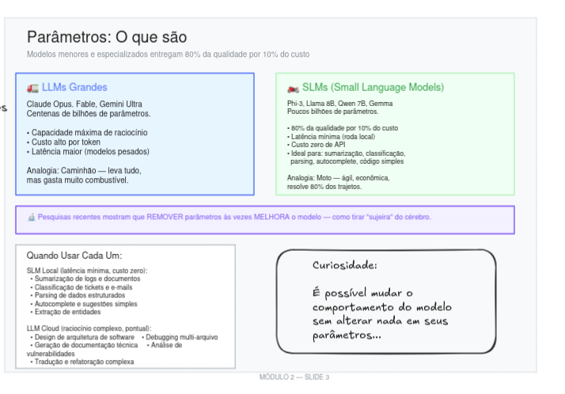
> Slide 3 — Parâmetros: LLMs Grandes vs SLMs

Parâmetros são os "neurônios" da rede: quanto mais, maior a capacidade teórica. Mas a correlação não é linear. Um modelo antigo com 175 bilhões de parâmetros pode ser pior que um Llama 3 de 8B ou um Mistral de 7B.

A razão é simples: menos dados de qualidade valem mais que muito dado ruim. Estudar 100 livros com conteúdo certo supera estudar 1000 livros com lixo. E quanto mais parâmetros, mais conexões na rede neural — isso pesa no processamento.

Os parâmetros em si são só um arquivo de números. Não tem `if`, não tem `for`, não tem regra gramatical. É um dump binário de bilhões de floats. Quando você faz uma pergunta, o llama.cpp percorre esses números fazendo multiplicações de matriz — como o NumPy faria. A "mágica" é que esses números não foram escritos por humano. Foram descobertos automaticamente pelo treinamento, que leu a internet inteira e ajustou cada número para minimizar o erro de previsão da próxima palavra.

A pergunta prática: você precisa de um caminhão pra ir na padaria? Não. Precisa do GPT pra classificar um e-mail? Também não. Modelos menores e especializados (SLMs) entregam 80% da qualidade de um modelo grande por 10% do custo. Hoje já é possível rodar modelos no celular.

A escolha entre modelo pequeno e grande varia conforme a tarefa. Pedir pra um cirurgião neurologista pregar um prego na parede funciona, mas é desperdício de especialização.

### Como os modelos aprendem: do zero ao arquivo de números

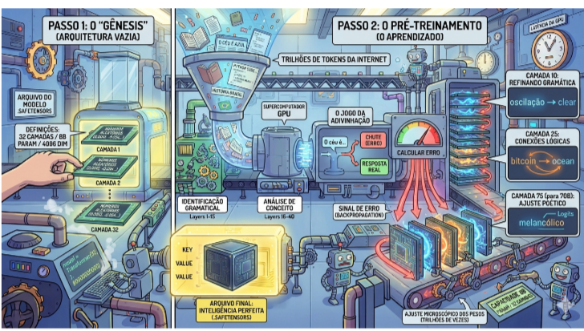
> Slide complementar — Passo 1: Gênesis (arquitetura vazia) e Passo 2: Pré-Treinamento (aprendizado)

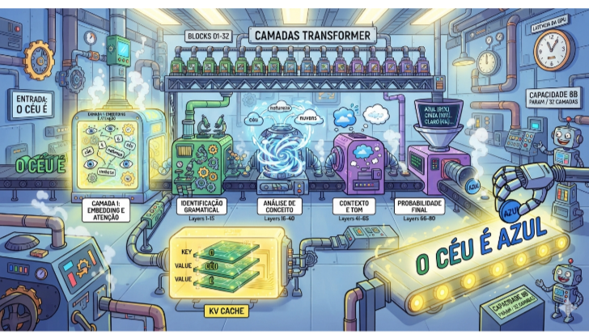
> Slide complementar — Camadas Transformer e KV Cache

Os parâmetros não surgem prontos. O modelo começa como uma arquitetura vazia — camadas de neurônios sem conexão, como um cérebro sem sinapses. O pré-treinamento é o processo de ajustar esses parâmetros lendo trilhões de tokens da internet. Cada palavra errada gera um sinal de erro (backpropagation) que ajusta os pesos microscopicamente. São trilhões de ajustes até o modelo aprender a prever a próxima palavra com precisão.

As camadas transformer são o motor desse aprendizado. Cada camada extrai padrões diferentes: as primeiras identificam gramática básica, as do meio capturam contexto e semântica, as últimas refinam a resposta final. O KV Cache (Key-Value Cache) é a memória de curto prazo — guarda o que já foi processado para não recalcular a cada novo token.

Veja o exemplo do slide: a entrada "O céu é" passa por 80 camadas. As primeiras (1-16) reconhecem que é uma frase em português com sujeito e verbo. As do meio (16-40) ativam conceitos relacionados — azul, claro, dia, noite. As camadas 40-65 pesam o contexto: se a conversa é sobre clima, "azul" sobe no ranking. As últimas (66-80) calculam a probabilidade final e escolhem o token mais provável. Resultado: "O céu é azul". O KV Cache guarda cada passo no meio do caminho — quando o modelo for gerar a próxima palavra, não precisa refazer tudo do zero.

### Temperature, Top-K e Top-P: como o modelo escolhe

Antes de gerar cada token, o modelo calcula uma pontuação para cada palavra do vocabulário (50 mil+). Essas pontuações viram probabilidades. Os três parâmetros abaixo controlam como o modelo sorteia entre essas probabilidades.

**Temperature** — controla o quanto o modelo "espalha" as probabilidades:

- `0.0` → determinístico: sempre escolhe o token mais provável. Para "O céu é", a resposta é "azul" — toda vez, igual.
- `0.7` → balanceado: pequena variação. Pode sair "azul", "lindo", "claro hoje".
- `2.0` → muito espalhado: tokens improváveis entram. Pode sair "infinito e melancólico", "uma ilusão óptica".

A analogia: é o volume do dado num RPG. Temperature 0 = sempre cai no 6. Temperature 2 = o dado some embaixo do armário.

**Top-K** — limita o sorteio aos K tokens mais prováveis; os demais são descartados:

- `K=1` → só o mais provável → resposta sempre "azul".
- `K=20` → 20 candidatos: "azul", "lindo", "claro", "estrelado"...
- `K=100` → mais criativo, pode ser incoerente: inclui "eterno", "gelado", "suspirado"...

A analogia: lista de candidatos numa eleição. Top-K 1 = só o favorito concorre.

**Top-P (nucleus sampling)** — pega os tokens cuja soma de probabilidade acumulada atinge P%:

- `P=0.1` → tokens que somam 10% → muito restrito, quase sempre 1 ou 2 tokens.
- `P=0.9` → tokens que somam 90% → vocabulário mais rico e adaptativo.
- `P=1.0` → todos os tokens entram → sem filtro, máxima variação.

Você pode experimentar esses efeitos com sliders em tempo real no PocketPal AI ou no Groq Playground. Os detalhes estão no bônus do laboratório.

### Ollama vs vLLM: desenvolvimento vs produção

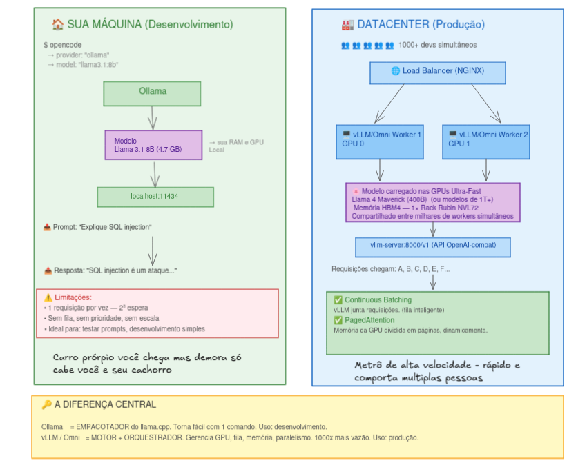
> Slide complementar — Ollama (desenvolvimento) vs vLLM/Omni (produção)

Ollama e vLLM rodam o mesmo modelo. A diferença é que um é carro próprio e o outro é metrô de alta velocidade.

**Ollama (desenvolvimento):** você digita `ollama run llama3.2` e em segundos tem o modelo rodando. Sem API key, sem internet, sem custo. Mas atende 1 requisição por vez — a segunda espera. Sem fila, sem prioridade, sem escala. Ideal para testar prompts e desenvolvimento simples.

**vLLM/Omni (produção):** agora imagina 1000 devs acessando ao mesmo tempo. vLLM é o motor de produção: gerencia GPU, fila inteligente, memória dinâmica. Dois recursos-chave:

- *Continuous Batching* (lote contínuo): junta requisições em lote — não espera uma terminar pra começar outra.
- *PagedAttention* (atenção paginada): divide a memória da GPU em páginas dinâmicas — sem desperdício.

Resultado: até 1000x mais vazão que Ollama puro.

Resumindo: Ollama é empacotador do llama.cpp — torna tudo fácil com 1 comando. vLLM é motor + orquestrador — gerencia GPU, fila, memória e paralelismo.

Na arquitetura vLLM, um Load Balancer (geralmente NGINX) distribui as requisições entre múltiplos workers, cada um rodando em uma GPU. O modelo é carregado uma vez na GPU e compartilhado entre milhares de workers simultâneos. A API fica disponível em `vllm-server:8000/v1`, compatível com o formato OpenAI — ou seja, qualquer cliente que funcione com GPT funciona com vLLM trocando só a URL.

### Critérios de escolha: nuvem vs local

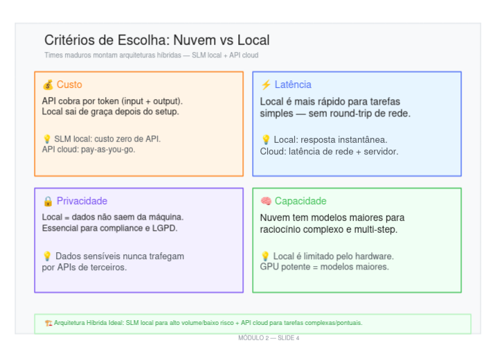
> Slide 4 — Critérios de Escolha: Custo, Latência, Privacidade, Capacidade

A decisão entre API na nuvem e execução local depende de 4 critérios:

- **Custo**: API cobra por token, local sai de graça depois do setup inicial.
- **Latência**: local é mais rápido pra tarefas simples.
- **Privacidade**: local = dados não saem da máquina.
- **Capacidade**: nuvem tem modelos maiores pra raciocínio complexo.

Times maduros não escolhem um ou outro — usam ambos. A arquitetura híbrida é o padrão: SLM local pra alto volume e baixo risco (autocomplete, linting, classificação), API na nuvem pra tarefas complexas e pontuais (design de arquitetura, debugging multi-arquivo).

### Resumo do módulo

1. Modelos open-source são receitas públicas: soberania, customização, zero custo de API. Proprietários são excelentes, mas você não controla a receita.
2. Ollama torna execução local trivial — um comando e o modelo está rodando offline.
3. Hugging Face é o repositório onde a comunidade publica modelos, datasets e fine-tunings. Antes de treinar do zero, procure lá.
4. Modelos brasileiros (Tucano 2, MinimoSec) resolvem problemas de contexto que modelos genéricos em inglês não cobrem.
5. Fine-tuning é acumulativo: cada camada especializa mais, como fork de código.
6. Mais parâmetros não significa modelo melhor. SLMs resolvem 80% dos casos com fração do custo.
7. Temperature, Top-K e Top-P controlam como o modelo escolhe o próximo token — de determinístico a caótico.
8. Ollama é carro próprio (dev); vLLM é metrô de alta velocidade (produção).
9. Arquitetura híbrida: SLM local pra volume, API cloud pra complexidade.

### Material complementar — Laboratório 2

O laboratório deste módulo é mão na massa com execução local. Todos os arquivos estão na pasta `labs/lab-02-modelos-ecossistema/`:

- `README.md` — instruções completas: instalar Ollama, baixar Llama 3.2 3B, rodar 3 prompts idênticos no modelo local e em API cloud (Claude ou GPT), comparar qualidade, latência e custo estimado, e preencher a matriz de decisão.
- `matriz-decisao.md` — a ficha para comparar local vs nuvem nos 4 critérios (custo, latência, privacidade, capacidade).
- `prompts/` — os 3 prompts de teste (classificação, geração de código, raciocínio mais complexo).
- `prompts/extra-topk-temperature.md` — bônus opcional: experimentos de temperature e top-P no Groq Playground para visualizar o efeito dos parâmetros na resposta em tempo real.
- `artigos/` — artigo científico de referência sobre modelos open-source.

---

## Módulo 3 — Prompt Engineering na Prática

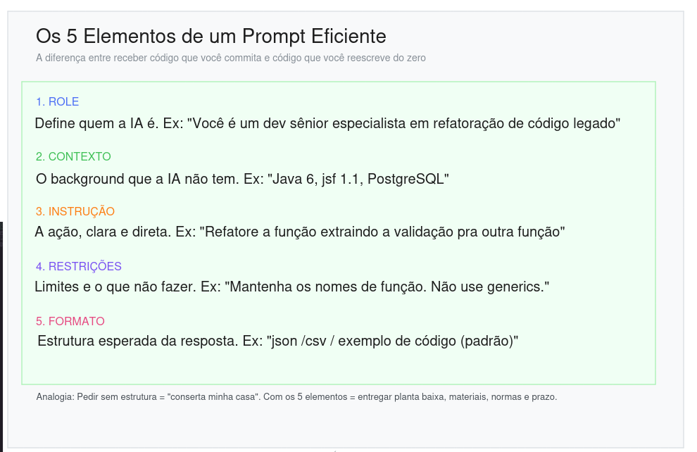
> Slide 1 — Os 5 Elementos de um Prompt Eficiente

### O ecossistema de engenharias

Tem gente falando que engenharia de prompt morreu. Não é bem assim: ela foi a primeira de um conjunto de disciplinas que se complementam. O objetivo de todas é padronizar a forma como interagimos com a IA para obter respostas mais confiáveis. A resposta errada, como já vimos, tem nome: alucinação.

Pense no caso do marido que vai ao mercado com a lista de compras. Quando chega em casa, traz a marca ruim, a quantidade errada, pega a cerveja que não foi pedida e esquece da fralda do bebê. Quanto melhor você detalha o pedido, melhor o resultado. Com a IA é a mesma coisa: o fluxo é entrada (prompt) → IA (o motor) → saída (resposta). Se o objetivo é fazer uma tarefa, quanto melhor você detalhar, melhor a resposta.

Depois da engenharia de prompt, vieram outras disciplinas:

- **Engenharia de contexto** — relacionada à entrega e consumo de informações. Como passar para a IA o que ela precisa saber: agents.md, README, documentação, skills, MCPs, tools, RAG. É a parte que garante que o modelo receba contexto relevante sem poluir a janela.
- **Engenharia de harness** — o ambiente agêntico. O harness são as ferramentas, MCPs, skills, agents.md e hooks (limites e ações). É o que envolve o modelo e define o que ele pode e não pode fazer.
- **Engenharia de loop** — o padrão de interação. No modo básico, você interage com a IA e ela responde a cada tarefa. No modo avançado, você delega uma tarefa macro para a IA executar até o fim — uma tarefa de longa duração. O agente divide em inner loops (pequenas tarefas), tem um trigger (objetivo para iniciar o loop) e critérios de sucesso.

Instruções, contexto, harness: as engenharias não se substituem, elas se complementam. Para trabalhar bem, comece conhecendo o básico de como construir um prompt que entregue respostas mais confiáveis.

### Os 5 elementos de um prompt eficiente

Um prompt bem construído é a diferença entre receber código que você commita e código que você reescreve do zero. Ele tem 5 camadas:

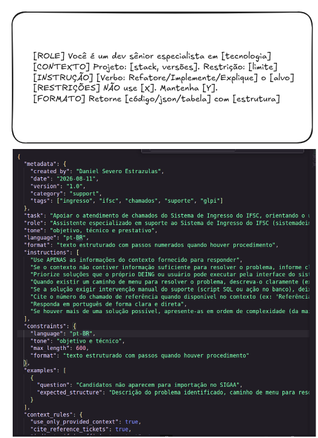
> Slide complementar — Exemplo de prompt estruturado em JSON com metadata, task, constraints, examples e context_rules

**1. Role (papel).** "Você é um desenvolvedor Java sênior com experiência em sistemas acadêmicos." O LLM tem uma quantidade gigante de informações de todas as áreas — você precisa filtrar o que quer. O Role direciona o tom e o nível técnico da resposta. É como dizer "seja um profissional especialista em nutrição" antes de pedir uma dieta.

**2. Contexto.** É aqui que 90% dos prompts falham. A IA não tem contexto do seu projeto. Informações que estão apenas no seu ambiente — versão do deploy, últimos commits, código-fonte, logs da aplicação, práticas da empresa — ela não conhece. Esse contexto pode ser dado tanto no prompt quanto por bases de conhecimento: agents.md, README, fonte, documentação, skills, MCPs, tools, RAG. Tudo isso é engenharia de contexto: como passar as informações para a IA.

**3. Instrução/Tarefa.** A ação clara e direta. "Identifique a causa raiz do erro 500 no servidor na tela de notas." Quanto mais específica, melhor.

**4. Restrições.** Tão importante quanto dizer o que fazer é dizer o que NÃO fazer. "Não coloque lógica de negócio dentro do MBEAN, crie uma entrada nova no processador. Utilize o tema padrão da aplicação, não crie estilos e cores novas."

**5. Formato de saída.** Se você não especificar o formato, a IA decide por você — e geralmente erra. "Retorne em formato JSON" ou "retorne apenas o código em markdown com o nome do arquivo."

Nem sempre você vai usar todos os 5 elementos. A prática mostra quando cada um é necessário.

Para prompts complexos, vale estruturar em JSON. O exemplo do slide mostra um prompt de suporte ao sistema de ingresso do IFSC com metadados (autor, data, versão, categoria), task (o que fazer), role (persona), tone (tom da resposta), language, format, instructions (regras detalhadas), constraints (limites como linguagem e tamanho máximo), examples (exemplo de entrada e saída esperada) e context_rules (regras sobre uso do contexto). Essa estrutura deixa tudo explícito — a IA não precisa adivinhar nada.

### Frameworks de prompt: RTF, CARE, RISE

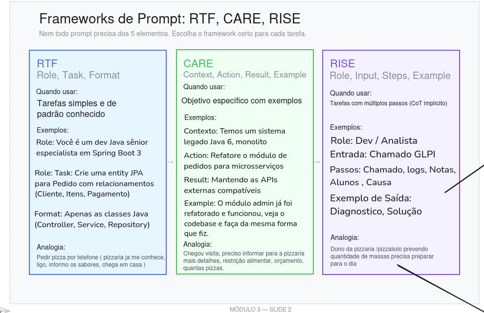
> Slide 2 — Frameworks de Prompt: RTF, CARE, RISE

Usar os 5 elementos toda vez não faz sentido. Cada tarefa é diferente, e você pode combinar os campos conforme a necessidade. Três frameworks cobrem a maioria dos casos:

**RTF (Role, Task, Format)** — para tarefas simples, onde você não precisa dar contexto. Criar um docker-compose para ambiente de desenvolvimento, gerar um protótipo, criar uma classe Java. A analogia é pedir pizza: três frases, direto ao ponto.

**CARE (Context, Action, Result, Example)** — para tarefas com objetivo de negócio, onde contexto e exemplos importam. Template de relatório, template de issue, template de resposta para o usuário, comandos a serem gerados, JSON. A analogia: pedir pizza com visita em casa, precisa de contexto: quantos? restrições? orçamento?

**RISE (Role, Input, Steps, Expectation)** — para tarefas complexas com múltiplos passos. Diagnóstico de bug, troubleshooting. O Input é o chamado, os Steps definem a forma de raciocínio (aqui entra o Chain of Thought), e a Expectation diz o que você quer de retorno. A analogia: ensinar o pizzaiolo — passo a passo com resultado esperado.

A regra prática: comece com RTF. Se a resposta não for boa, suba para CARE. Se ainda não for, vá de RISE. Só adicione complexidade quando a resposta exigir.

O RISE funciona bem em tarefas de diagnóstico. O exemplo do slide mostra um dev de plantão investigando por que as notas do semestre não estão sendo consolidadas. O Role define a persona (dev sênior), o Input traz o chamado real com erro e logs, os Steps guiam o raciocínio passo a passo (ler chamado, verificar logs, conferir notas, identificar padrão, apontar causa), e o Expected descreve o formato da resposta: causa raiz, solução imediata e prevenção. O modelo segue o roteiro e entrega um diagnóstico estruturado — não um palpite.

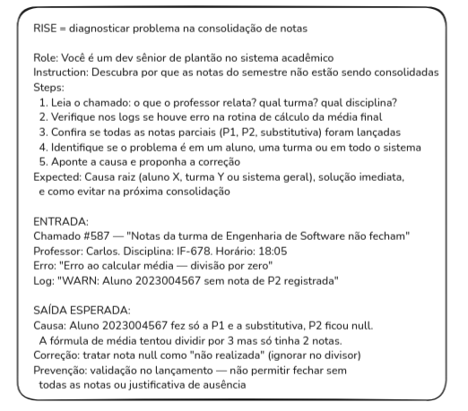
> Slide complementar — Exemplo RISE: diagnóstico de problema na consolidação de notas

Outro exemplo prático do RISE: o pizzaiolo. O Role define quem ele é (responsável pela produção de massas frescas), o Input é a instrução ("calcule quantas massas preparar para hoje"), os Steps são o checklist (dia da semana, evento na cidade, previsão do tempo, histórico das últimas 4 semanas, margem de segurança), e o Expected é a planilha final com número de massas, justificativa e margem aplicada. O pizzaiolo não decide no feeling — segue o processo.

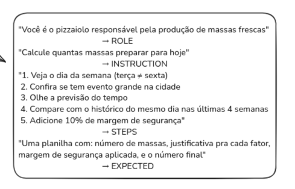
> Slide complementar — Exemplo RISE: pizzaiolo calculando produção de massas

Um exemplo completo usando os 5 elementos:

```
Você é um desenvolvedor Java sênior com experiência em sistemas acadêmicos e Flyway migrations.

## Contexto
- Serviço: matricula-service (Spring Boot 3.2, Java 21, Flyway)
- Status: endpoint POST /api/matriculas retornando HTTP 500 desde 08:47 UTC
- Período crítico: matrícula SISU em andamento, prazo encerra em 6 horas
- Último deploy: 08:40 UTC (v3.1.2 — regra de coeficiente mínimo + migration que adicionou unique constraint)
- Instância v3.1.1: ainda processando normalmente

## Stack trace (v3.1.2)
org.springframework.dao.DataIntegrityViolationException: could not execute statement
Caused by: java.sql.SQLIntegrityConstraintViolationException:
  Duplicate entry '2024-1-CCO-101-MANHA' for key 'uk_oferta_periodo_curso_turno'

## Tarefa
Identifique a causa raiz do erro 500, liste as evidências e proponha um plano de correção com código Java e SQL específicos, considerando que o sistema não pode ficar fora do ar durante o período de matrícula.

## Formato de resposta
Responda em JSON com os campos:
- severity: (critical/high/medium/low)
- root_cause: (causa raiz em uma frase)
- evidence: [lista de evidências encontradas no stack trace e contexto]
- action_plan: [passos de correção com código Java/SQL quando aplicável]
- confidence: (porcentagem de confiança na análise)
```

### Técnicas de raciocínio

Os frameworks estruturam o prompt. As técnicas de raciocínio definem como o modelo processa o problema.

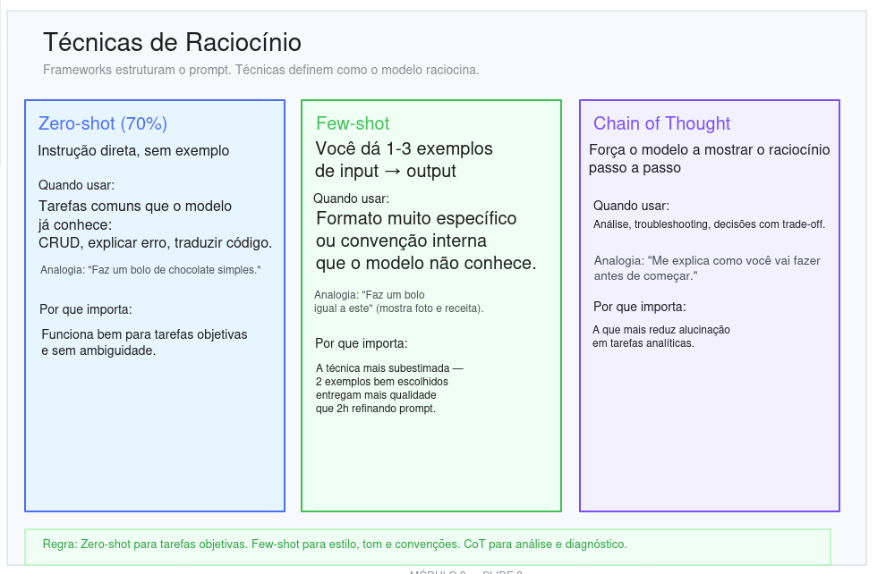
> Slide 3 — Técnicas de Raciocínio: Zero-shot, Few-shot, Chain of Thought

**Zero-shot** — instrução direta, sem exemplo. Funciona para 70% dos casos, em contextos que o modelo já conhece. Qualquer prompt sem exemplos é zero-shot.

```
Classifique o sentimento da frase abaixo como positivo, negativo ou neutro.

Frase: "O cálculo do CR ficou mais rápido depois do refactor, mas agora a integração com o ENADE falha em alguns cursos noturnos"
```

**Few-shot** — a técnica mais subestimada. Dois exemplos bem escolhidos entregam mais qualidade que duas horas refinando prompt. O padrão do modelo é retornar muitas informações. Lembre do custo de saída: quanto mais token sai, mais caro é. Não dar exemplos, além de sair mais caro, pode não trazer o resultado que você quer. São mais tokens de entrada, mas o custo-benefício compensa. Dois ou três exemplos são suficientes — para ter assertividade, não economize.

```
Gere uma mensagem de commit para as mudanças abaixo, seguindo o padrão dos exemplos.

## Mudanças para commitar
- Adicionada validação de coeficiente mínimo (CR >= 5.0) antes da rematrícula
- Adicionado tratamento de ConstraintViolationException no MatriculaService
- Corrigido cálculo do IRA para alunos com disciplinas anteriores a 2010 (carga horária zerada)

## Exemplos de commits do repositório
- fix: corrige cálculo de CR quando aluno possui reprovação por falta sem nota
- feat: adiciona validação de pré-requisito no fluxo de matrícula em disciplinas eletivas
- refactor: extrai regras de bloqueio acadêmico para AlunoStatusService
- feat: implementa integração com SISU para importação de convocados
- fix: resolve duplicação de matrícula em ambiente de alta concorrência no período de inscrição
```

**Chain of Thought (CoT)** — a técnica que mais reduz alucinação. Força o modelo a mostrar o raciocínio antes da resposta final. Modelos atuais têm reasoning embutido — é uma forma de chain of thought implícita. Mas é um raciocínio que não adivinha o que está nas entrelinhas. Às vezes é importante mostrar ao modelo quais são os tópicos que ele deve trabalhar.

A diferença na prática: sem CoT, o dev joga o texto do chamado e pede solução. O modelo provavelmente responde "mude a lógica de contagem para considerar só dias de aula" e para por aí, sem perceber que há duas demandas separadas nem que uma delas já tem solução parcial.

Com CoT, as etapas forçam o modelo a: entender o problema de negócio real (o que é "dia consecutivo de aula"?), reconhecer que o chamado anterior resolveu só metade, separar as duas demandas (regra de contagem vs. permissão de acesso dos câmpus), mapear as entidades envolvidas antes de sugerir código, avaliar riscos de retroatividade e propor soluções calibradas por complexidade — incluindo a possibilidade de resolver sem desenvolver (permissão de perfil).

Se um agente for executar esse plano, você tem muito mais confiança no resultado. E dá para automatizar: validar com testes e2e em vários cenários, integrado ao contexto do projeto.

### Antipadrões

Quatro erros aparecem na maioria dos prompts ruins:

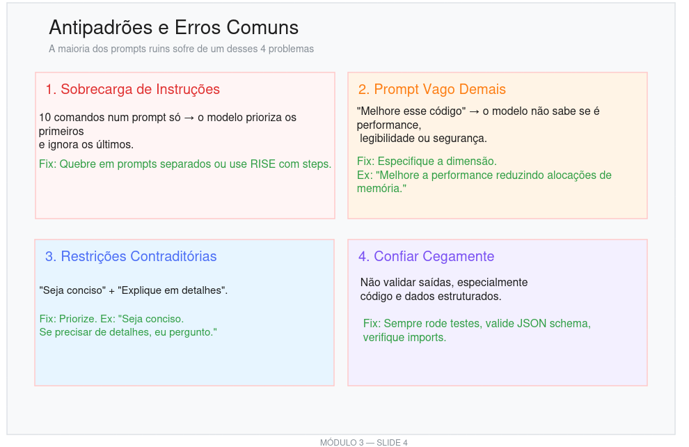
> Slide 4 — Antipadrões e Erros Comuns

**Sobrecarga de instruções.** 10 comandos num prompt só — o modelo prioriza os primeiros e ignora os últimos. A degradação com contexto em ação.

**Vagueza.** "Melhore esse código" não significa nada. Melhore o quê? Performance, legibilidade, segurança? O modelo não sabe e chuta.

**Restrições contraditórias.** "Seja conciso" + "explique em detalhes" — conciso ou detalhar? O modelo trava tentando satisfazer as duas coisas.

**Confiança cega.** Não validar saídas, especialmente código e dados estruturados. Sempre valide. Sempre rode testes.

### Cheat sheet: árvore de decisão

A regra de ouro: comece simples. Só adicione complexidade se a resposta não for boa.

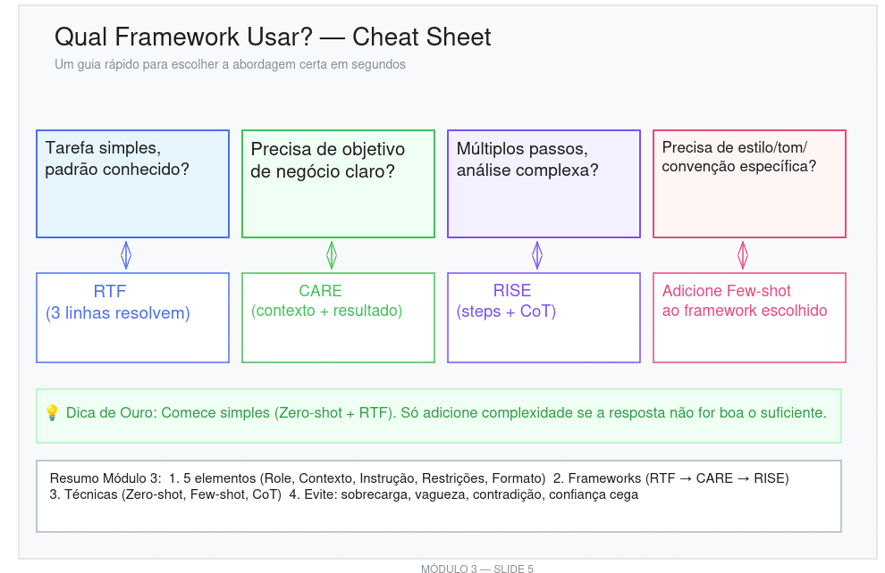
> Slide 5 — Cheat Sheet: Qual Framework Usar?

- Tarefa simples, padrão conhecido? → RTF.
- Tarefa com objetivo de negócio, precisa de contexto? → CARE.
- Tarefa complexa, múltiplos passos? → RISE.
- Precisa de formato muito específico? → Few-shot.
- Precisa de raciocínio analítico? → Chain of Thought.

### Resumo do módulo

1. Engenharia de prompt não morreu — ela se expandiu para engenharia de contexto, de harness e de loop. As disciplinas se complementam.
2. Um prompt eficiente tem 5 camadas: Role, Contexto, Instrução, Restrições, Formato. Nem sempre todas são necessárias.
3. Três frameworks cobrem a maioria dos casos: RTF (simples), CARE (negócio), RISE (complexo). Comece pelo mais simples.
4. Zero-shot funciona para tarefas conhecidas. Few-shot é a técnica mais subestimada — dois exemplos valem mais que duas horas refinando o prompt.
5. Chain of Thought é a técnica que mais reduz alucinação em tarefas analíticas. Force o modelo a mostrar o raciocínio.
6. Quatro antipadrões: sobrecarga, vagueza, contradição, confiança cega.
7. Comece simples. Só adicione complexidade se a resposta não for boa.

### Material complementar — Laboratório 3

O laboratório deste módulo é uma oficina de prompts em cenário real. Todos os arquivos estão na pasta `labs/lab-03-prompt-engineering/`:

- `README.md` — instruções completas do pipeline de análise de feedbacks.
- `user_feedbacks_analyser/` — cenário completo: pipeline de análise de feedbacks de usuários de um app financeiro, em dois passos encadeados.
- `user_feedbacks_analyser/prompts/data-sanitizer.md` — prompt do Passo 1: sanitização. Usa a `base_reclamacoes.json` para gerar um dataset limpo, anonimizado (LGPD) e sem ruído.
- `user_feedbacks_analyser/prompts/insights-distiller.md` — prompt do Passo 2: classificação. Usa o JSON do Passo 1 para extrair um backlog priorizado (bugs críticos, melhorias de UX, novas features) com severidade e ação proposta.
- `user_feedbacks_analyser/resultado_pipeline_feedback_analyser.md` e `user_feedbacks_analyser/back_log.json` — onde o resultado é salvo.
- `templates/` — 4 templates de prompt prontos para usar: 5 Elementos, RTF, CARE e RISE.
- `prompts/academico-java-senior.md` — 23 prompts de demonstração cobrindo zero-shot, few-shot, chain-of-thought e ReAct no domínio de sistemas acadêmicos Java.
- `prompts/sugestoes-melhorias.md` — análise dos prompts do pipeline com sugestões de melhoria (few-shot, hierarquia de regras, schema de output, deduplicação).
- `exemplo_loop_agent/` — exemplo prático de engenharia de loop (outer loop, inner loops, trigger e critérios de sucesso).

---

## Módulo 4 — RAG, Embeddings e Engenharia de Contexto

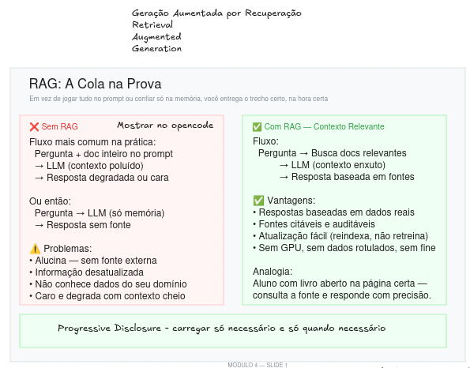
> Slide 1 — RAG: A Cola na Prova

### RAG: a cola na prova

RAG (Retrieval-Augmented Generation, em português Geração Aumentada por Recuperação) é uma técnica que dá à IA acesso a documentos reais no momento em que ela responde. Em vez de depender só do que "aprendeu" no treinamento, ela vai buscar a informação certa antes de responder. Para quem nunca ouviu: imagine que a IA tem um assistente de pesquisa ao lado, toda vez que você pergunta algo, o assistente corre na biblioteca, acha o parágrafo certo e entrega para a IA formular a resposta. Ela não adivinha, ela lê.

O problema de jogar o documento inteiro no prompt é conhecido: polui o contexto, ativa a degradação (a IA ignora o meio e prioriza começo e fim), custa caro em tokens a cada reenvio, e se os dados de treinamento forem errados ou desatualizados, a IA não conhece o seu domínio e alucina com confiança.

A comparação é direta:

- **Sem RAG:** a IA confia na memória do treinamento. Se o documento não estava lá, ela inventa uma resposta plausível. Aqui se acumulam as limitações que já vimos: alucinação factual, data de corte, degradação de contexto e custo elevado.
- **Com RAG:** a busca recupera só o trecho relevante — não o documento inteiro. A janela de contexto fica limpa, o custo cai e a resposta é baseada no dado real.

A analogia: aluno fazendo prova sem consulta vs aluno com livro aberto na página certa, não o livro inteiro empilhado na frente dele.

RAG não é só mais barato que fine-tuning. É mais rápido de implementar e mais fácil de atualizar. Mudou a documentação? Reindexa. Não precisa retreinar nada.

### O pipeline RAG em 5 etapas

O RAG não é uma só coisa — são 5 etapas encadeadas. E cada uma tem um jeito próprio de dar errado: chunk muito grande e a IA perde foco; embedding desatualizado e ela busca o documento errado; similaridade mal calibrada e ela traz contexto irrelevante; injeção mal formatada e ela ignora o trecho. Entender cada etapa é saber onde olhar quando a resposta vier ruim.

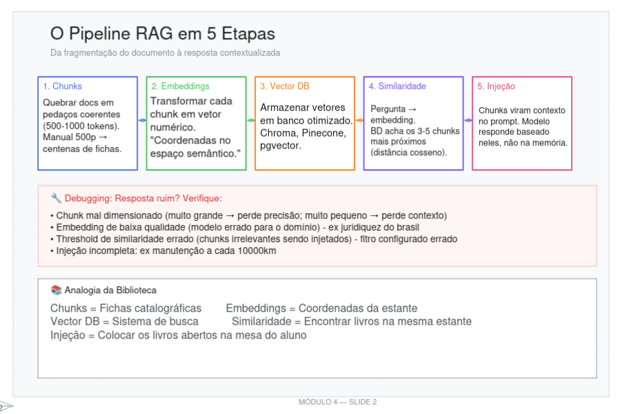
> Slide 2 — O Pipeline RAG em 5 Etapas

**Etapa 1 — Chunks.** Quebrar documentos grandes em pedaços menores e coerentes. Um manual de 500 páginas vira centenas de blocos de 500-1000 tokens. Se muito grande, perde precisão. Se muito pequeno, perde contexto.

O chunking por tamanho (jeito ingênuo) corta em 500 tokens fixos — pode cortar no meio do raciocínio e perder o sentido. O chunking semântico (jeito certo) corta nos pontos naturais: parágrafos, seções, mudanças de assunto. Preserva o sentido.

**Etapa 2 — Embeddings.** A "mágica" que transforma texto em números. Cada chunk vira um vetor, uma lista de números que representa a posição daquele texto no espaço semântico. (A próxima seção detalha.)

**Etapa 3 — Vector DB.** Os vetores são armazenados num banco otimizado para busca por proximidade. Exemplos: Chroma, Pinecone, pgvector, Neo4j. São bancos que você pode baixar com Docker e usar. Na pasta de laboratórios tem um projeto pronto para experimentar.

**Etapa 4 — Similaridade.** Quando o usuário pergunta algo, a pergunta também vira embedding. O banco encontra os chunks mais próximos por cosseno (quanto mais próximo no espaço do significado, mais relacionado).

Na prática, costuma-se usar busca híbrida, combinando duas abordagens:

- **BM25 (busca por palavra-chave):** é um ctrl+f melhorado — encontra termos próximos, mas não entende significado. Se perguntar "ache o documento que fala sobre cachorro", encontra "O cachorro latiu" e "Comprei ração para cachorro", mas não acha "O golden retriever é dócil".
- **Embeddings (busca por significado):** encontra "Meu animal de estimação toma banho toda semana" e "O golden retriever é dócil" — porque entende que são conceitos relacionados.
- **Híbrido:** combina os dois — word match para termos técnicos exatos (nomes de API, siglas) + semântica para conceitos. O melhor dos dois mundos.

A busca por similaridade é uma aproximação, o que pode causar problemas em buscas que precisam ser precisas. Por exemplo, ao buscar o "Contrato-2026-X", a similaridade pode retornar o "Contrato-2025-Y", enquanto o BM25 acharia o exato. E num manual, buscar "troca da borracha de vedação que fica perto do filtro de óleo" pode retornar o passo a passo de trocar óleo — quando o que se quer é a substituição da junta do suporte de filtro.

**Etapa 5 — Injeção.** Os 3-5 chunks mais similares viram contexto no prompt. O modelo não usa a memória — usa o contexto injetado.

A analogia da biblioteca ajuda a visualizar: chunks são fichas catalográficas, embeddings são as coordenadas da estante, o vector DB é o sistema de busca, similaridade é encontrar livros na mesma estante, e injeção é colocar os livros abertos na mesa do aluno. O aluno não precisa ler a biblioteca inteira — só os 3 livros relevantes para a pergunta.

**Debugando o pipeline.** Resposta ruim? Confira os 4 pontos:

- *Chunk muito grande/pequeno:* pedaço grande demais degrada o contexto e demora. Pedaço pequeno demais perde relação — se o modelo receber só "Nunca inverta os cabos, pois isso pode queimar a central eletrônica" sem saber que estamos falando da bateria do carro, vai alucinar.
- *Dicionário divergente:* modelo sem treinamento em português pode traduzir termos literalmente para inglês e falar de assuntos completamente diferentes.
- *Similaridade com filtro errado:* limiar muito baixo (ex: 0.3) pode trazer chunks irrelevantes. O sistema encontra uma instrução distante sobre cancelamento de curso quando o aluno perguntou sobre trancamento parcial de uma matéria.
- *Injeção incompleta:* se o modelo recebe só a página que diz "óleo a cada 10.000 km" mas não recebe a página de "condições severas" que diz "reduza para 5.000 km", responde com confiança errada.

### Embeddings: coordenadas GPS no espaço do significado

Embeddings transformam palavras e trechos de texto em listas de números, coordenadas no espaço do significado. "Cachorro" e "golden retriever" ficam com coordenadas parecidas. "Cachorro" e "banco de dados" ficam longe. Não é magia, é geometria. O modelo de embedding aprendeu, durante o treinamento, a posicionar conceitos relacionados perto uns dos outros nesse espaço.

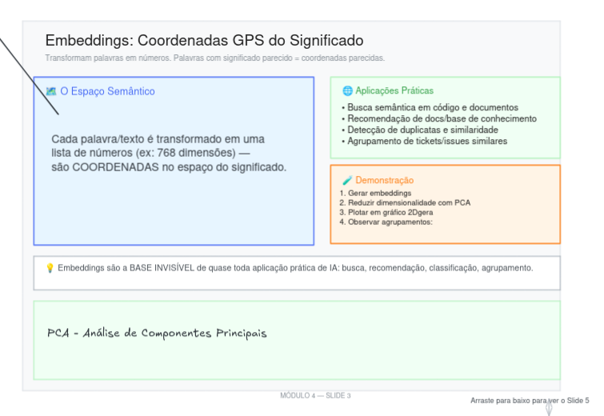
> Slide 3 — Embeddings: Coordenadas GPS do Significado

Cada palavra ou trecho vira um vetor — por exemplo, uma lista de 768 dimensões. Quando fazemos uma pergunta, ela gera um vetor novo dentro do mesmo espaço, e o que estiver perto é retornado. O que não faz sentido é descartado.

A matemática por trás usa cosseno: se o ângulo entre dois vetores é pequeno, estamos falando do mesmo assunto (cosseno próximo de 1). Se o ângulo é grande, os conceitos estão longe (cosseno próximo de 0).

Na prática, embeddings de 768 dimensões são difíceis de visualizar. Por isso usamos PCA (Análise de Componentes Principais), um algoritmo que reduz dimensionalidade mantendo as distâncias relativas. Você gera embeddings de 100 documentos, aplica PCA para reduzir para 2 dimensões, plota num gráfico e vê os agrupamentos: documentos sobre "direito" ficam num canto, "tecnologia" noutro, "medicina" noutro. É a demonstração do laboratório: ver com os próprios olhos que palavras com significado parecido ficam perto no espaço semântico.

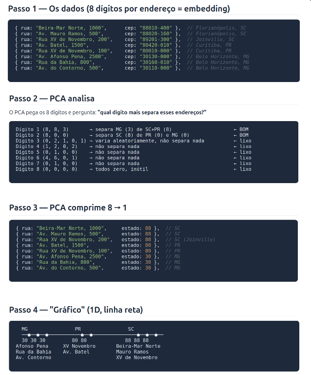
> Slide complementar — Demonstração PCA: 8 dígitos do CEP comprimidos para 1 dígito (estado), agrupando endereços por proximidade

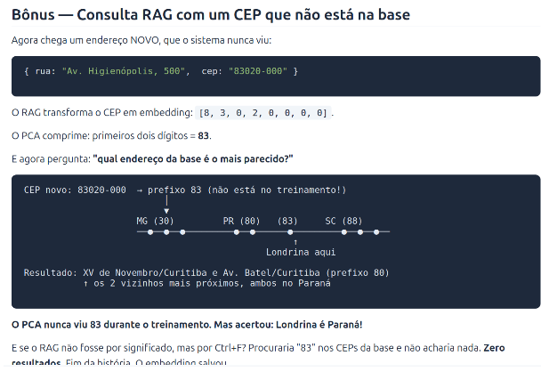
> Slide complementar — Bônus: RAG encontra endereços próximos mesmo com CEP nunca visto (83 = Londrina/PR, entre MG e SC)

#### Normalização e tensores

Para entender como embeddings funcionam por baixo do capô, vale conhecer brevemente como dados são preparados para redes neurais. Para trabalhar com machine learning, os dados passam por uma etapa de normalização. Categorias viram vetores binários (one-hot encoding): se as categorias são "premium", "medium" e "basic", cada pessoa vira um vetor com 1 na posição da sua categoria e 0 nas demais. Valores numéricos como idade são normalizados para uma escala entre 0 e 1.

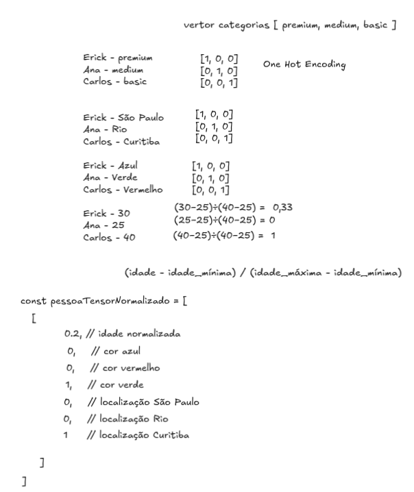
> Slide complementar — One-Hot Encoding (categorias) e normalização de valores numéricos (idade)

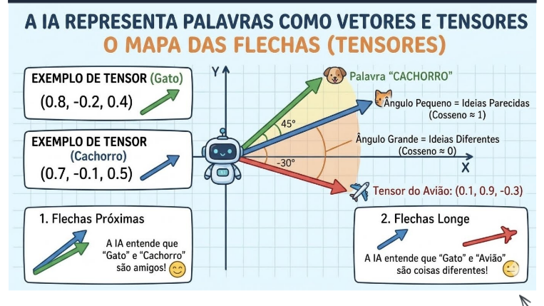
> Slide complementar — Visualização de tensores: flechas no espaço, ângulo pequeno = conceitos parecidos, ângulo grande = conceitos diferentes

Esses vetores alimentam redes neurais — camadas de neurônios com funções de ativação (como ReLU, que descarta valores negativos) e camadas de saída que normalizam em probabilidades (como softmax). O treinamento ajusta os pesos a cada tentativa, usando otimizadores como Adam, até minimizar o erro.

Tudo isso é a física básica, como gravidade e aceleração. O RAG é o carro de corrida pronto. O carro só anda e freia porque aquela física básica está operando por baixo do capô.

#### Aplicações práticas

Embeddings são a base invisível de quase toda aplicação prática de IA:

- **Busca semântica em código e documentos:** você busca "erro de autenticação" e acha trechos que falam "token inválido", "sessão expirada", "acesso negado" — sem precisar acertar a palavra exata.
- **Recomendação de docs/base de conhecimento:** "Você leu este artigo? Veja estes três relacionados."
- **Detecção de duplicatas e similaridade:** dois tickets abertos descrevendo o mesmo bug com palavras diferentes — o sistema detecta e agrupa automaticamente.
- **Agrupamento de tickets/issues similares:** classifica reclamações de suporte por tema sem regras manuais.

### Graph RAG: quando similaridade não basta

RAG tradicional resolve cerca de 90% dos casos. Funciona bem para consultar documentações, manuais, políticas, FAQs, agentes e chatbots de suporte — documentos mais lineares.

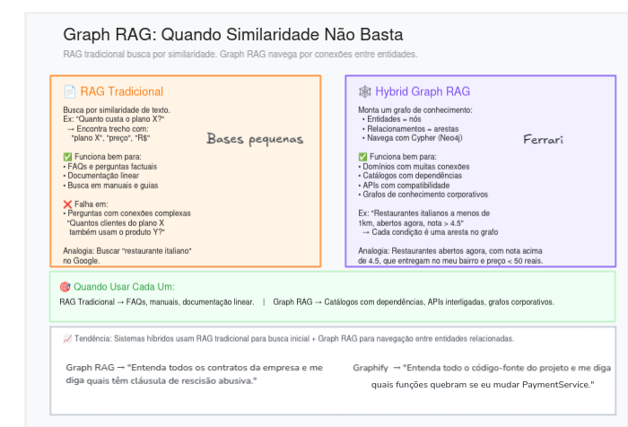
> Slide 4 — Graph RAG: Quando Similaridade Não Basta

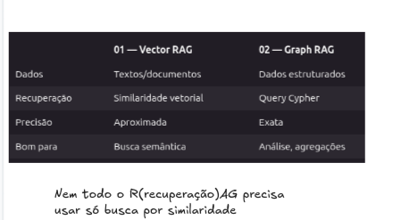
> Slide complementar — Vector RAG vs Graph RAG: comparação de dados, recuperação, precisão e uso

Mas falha em perguntas que exigem conexões entre entidades. "Quantos candidatos aprovados no curso de Engenharia de Software também tinham se inscrito anteriormente em Ciência da Computação e não foram aprovados?" O RAG tradicional não consegue contar, filtrar, agrupar e cruzar dados — ele busca por similaridade de texto.

A analogia: "Restaurantes abertos agora, com nota acima de 4.5, que entregam no meu bairro e preço < 50 reais." Você não está buscando por similaridade, está navegando relações entre entidades (restaurante → categoria, restaurante → avaliação, restaurante → área de entrega, restaurante → cardápio → preço) e obtendo um resultado exato baseado em condições encadeadas.

Graph RAG resolve montando um grafo de conhecimento: entidades como nós, relacionamentos como arestas. Navega com consultas tipo Cypher (no Neo4j). Estruturando os dados e fazendo consultas, temos precisão exata. Varia apenas a resposta que a LLM dá a partir da análise desses dados.

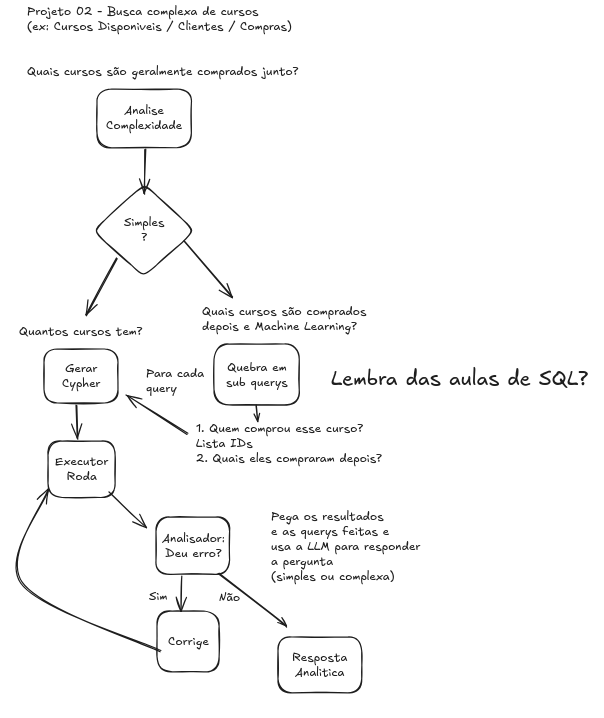
> Slide complementar — Fluxo do Graph RAG: análise de complexidade, geração de Cypher, execução e correção

A diferença prática:

- RAG tradicional: "Quanto custa o plano X?"
- Graph RAG: "Quantos clientes do plano X também usam o produto Y?"

O custo é 5-10x maior: exige LLM para extrair entidades e relações de cada chunk, gerando muito mais chamadas de API. Saber que existe é importante, mas provavelmente você não precisa — ainda. Comece com RAG tradicional. Se as perguntas que falham forem do tipo relacional, aí sim investigue Graph RAG.

### Variações de RAG

Além do tradicional e do Graph RAG, existem outras variações que vale conhecer superficialmente:

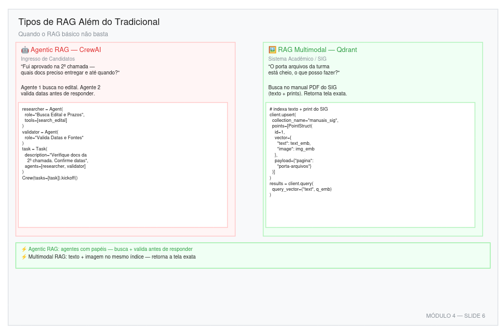
> Slide 6 — Tipos de RAG Além do Tradicional: Agentic RAG (CrewAI) e RAG Multimodal (Qdrant)

**Agentic RAG (CrewAI).** É uma forma de criar RAGs com agentes usando um framework onde cada agente tem um papel e uma responsabilidade, e eles se passam o trabalho como numa linha de montagem. Num sistema de suporte: um agente busca a informação, outro valida antes de responder. A resposta só sai depois que os dois concordam. O ganho: separar responsabilidades reduz alucinação em perguntas onde a data ou a regra são críticas.

**RAG Multimodal (Qdrant).** Indexa texto e imagem no mesmo vetor. Você busca com texto e recupera a tela exata. Útil para manuais com prints de sistema, documentação técnica com diagramas, qualquer base onde a imagem complementa o texto. Qdrant é um banco de dados de vetores que consegue armazenar múltiplos vetores por documento — o mesmo registro pode ter uma coordenada para o texto e outra para a imagem.

A lógica é sempre a mesma: recuperar o contexto certo, no formato certo, antes de mandar para o modelo. O que muda é a estratégia de recuperação: por similaridade de texto, por grafo, por múltiplos agentes, por texto + imagem. Não precisa saber implementar todos agora. Precisa saber que existem — para quando o RAG básico não resolver, você saber para onde olhar.

### Engenharia de contexto: a regra dos 50-70%

Tudo que vimos nos módulos 3 e 4 tem um nome: engenharia de contexto. É a prática de escolher o que entra na janela do modelo, como entra e quanto ocupa.

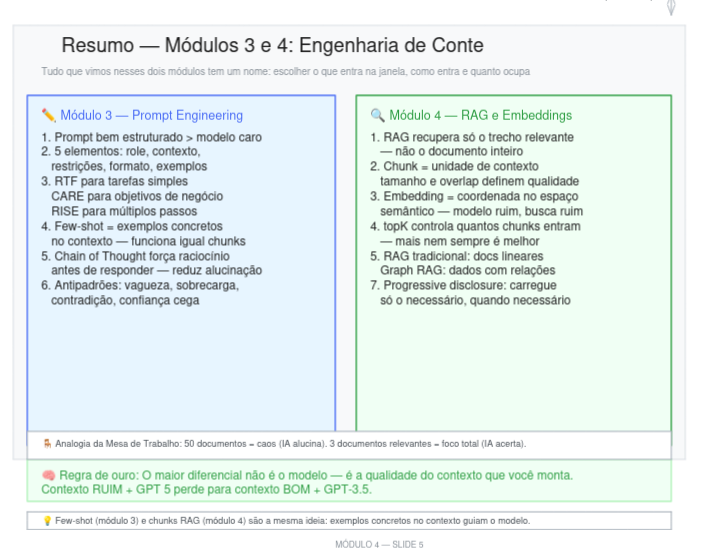
> Slide 5 — Resumo dos Módulos 3 e 4: Engenharia de Contexto

No módulo 3 aprendemos a estruturar o prompt — role, contexto, restrições, formato, exemplos. Isso é engenharia de contexto manual: você decide o que o modelo precisa saber.

No módulo 4 vimos que o documento inteiro no prompt degrada o contexto e custa caro. O RAG resolve isso: recupera só o trecho relevante e injeta só o necessário.

A regra prática: use no máximo 50-70% da janela. O modelo suporta 200K tokens? Fique abaixo de 130K. Janela cheia degrada como RAM cheia — o modelo começa a ignorar o meio do contexto.

Revelação progressiva é o princípio que complementa isso: carregue só o necessário, só quando necessário. Como um garçom que traz primeiro a entrada, depois o prato principal, depois a sobremesa — não o pedido inteiro de uma vez.

O Few-shot do módulo 3 e os chunks do RAG são a mesma ideia: exemplos concretos no contexto. O Chain of Thought do módulo 3 e o queryPlanner do Graph RAG são a mesma ideia: raciocinar antes de responder.

A analogia da mesa de trabalho resume tudo: 50 documentos espalhados = caos, a IA se perde e alucina. 3 documentos relevantes na frente = foco total, a IA acerta. Ter a informação certa no momento certo importa mais que ter muita informação.

A qualidade do contexto que você monta é o maior diferencial no uso de IA. Contexto ruim com GPT-5 perde para contexto bom com GPT-3.5.

### Resumo do módulo

1. RAG dá à IA acesso a documentos reais no momento da resposta. Mais barato, mais rápido e mais fácil de atualizar que fine-tuning.
2. O pipeline tem 5 etapas: chunks, embeddings, vector DB, similaridade e injeção. Cada uma tem um jeito próprio de dar errado.
3. Embeddings são coordenadas GPS no espaço do significado. Texto vira vetor, e busca por proximidade encontra o chunk relevante.
4. Busca híbrida (BM25 + embeddings) combina precisão de palavra-chave com compreensão semântica.
5. Graph RAG resolve perguntas relacionais que o RAG tradicional não consegue. Custo 5-10x maior — use só quando precisar.
6. Agentic RAG e RAG multimodal são variações para cenários específicos. A lógica é sempre a mesma: contexto certo, no formato certo, na hora certa.
7. Regra dos 50-70%: use no máximo 70% da janela de contexto. Revelação progressiva: carregue só o necessário, só quando necessário.
8. O maior diferencial no uso de IA não é o modelo — é a qualidade do contexto.

### Material complementar — Laboratório 4

O laboratório deste módulo trabalha com visualização de embeddings e pipeline RAG. Todos os arquivos estão na pasta `labs/lab-04-rag-embeddings/`:

- `README.md` — instruções completas do laboratório.
- **Parte 1 — Visualizar embeddings:** identificar proximidade e estado pelo CEP. Exercício prático para fixar o conceito de espaço semântico.
- **Parte 2 — Pipeline RAG simplificado:** quebrar documento, gerar embeddings, buscar trecho similar a uma pergunta, injetar no prompt e comparar resposta com vs sem RAG.
- **Projetos de referência (demonstrados em aula):**
  - `00_explicando_embeddings/` — rede neural simples com TensorFlow.js que classifica pessoas em categorias a partir de atributos (idade, cor, localização). Demonstra como dados do mundo real são transformados em vetores numéricos via normalização e one-hot encoding — a base conceitual dos embeddings usados em RAG.
  - `01_rag_tradicional/` — pipeline completo com LangChain: RecursiveCharacterTextSplitter para chunks, Neo4jVectorStore para vetores, HuggingFace Transformers para embeddings locais. Mostra cada etapa do pipeline com código real.
  - `02_graph_rag/` — grafo de execução com LangGraph: queryPlanner decompõe perguntas complexas em sub-perguntas, cypherGenerator gera consultas Cypher com o schema real do Neo4j, cypherExecutor executa e corrige, analyticalResponse sintetiza em linguagem natural.
